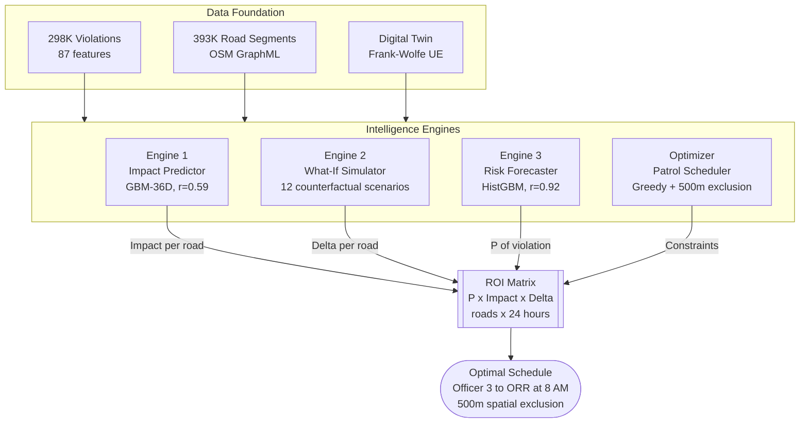
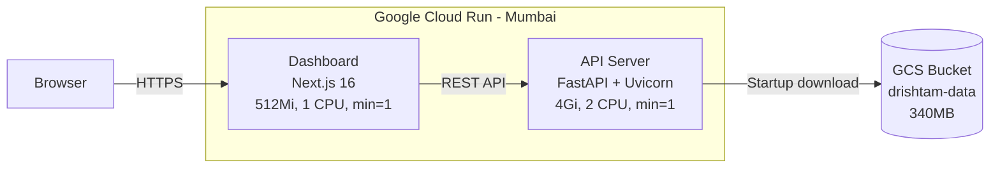
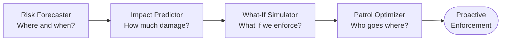
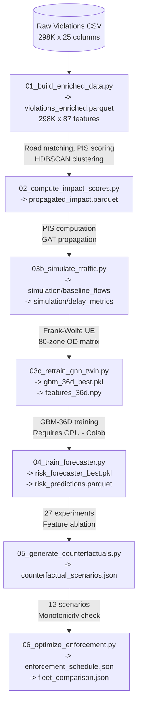

<div align="center">

# दृष्टम् — DRISHTAM

### *"That which has been revealed."*

**Predictive Enforcement Intelligence for Urban Parking-Induced Congestion**

[](https://python.org)
[](https://fastapi.tiangolo.com)
[](https://nextjs.org)
[](https://scikit-learn.org)
[](https://cloud.google.com/run)
[](https://pytest.org)

---

**🌐 Live Demo: [drishtam-dashboard-192403939373.asia-south1.run.app](https://drishtam-dashboard-192403939373.asia-south1.run.app)**

---

*Every day, **298,000 parking violations** choke Bengaluru's roads.*
*But not all violations are equal.*
*A car on a 6-meter residential street blocks **33% of capacity**.*
*The same car on a 14-meter primary road blocks just 14%.*

**DRISHTAM reveals the invisible cost of every illegally parked vehicle — and tells the police exactly where, when, and how many officers to deploy.**

</div>

---

## The Problem

> **Poor Visibility on Parking-Induced Congestion** — On-street illegal parking and spillover parking near commercial areas, metro stations, and events choke carriageways and intersections.

Bengaluru Traffic Police (BTP) receives ~300K parking violation reports annually from Astram cameras. Today, every violation is treated equally — a ₹500 fine regardless of whether it's on an empty residential street or a choked arterial during rush hour.

### Why It's Hard Today

| Challenge | Current State | Consequence |
|-----------|--------------|-------------|
| **Enforcement is patrol-based and reactive** | Officers patrol randomly with no prediction of where violations will occur | Resources wasted on low-impact areas; high-impact zones left uncovered |
| **No heatmap of parking violations vs. congestion impact** | Every violation gets the same ₹500 fine regardless of congestion effect | A violation blocking 33% of a 6m street is treated same as one blocking 14% of a 14m road |
| **Difficult to prioritize enforcement zones** | No quantification of which roads matter most, when, or how enforcement cascades through the network | Police cannot answer: *"If I have 50 officers, where exactly should each one be, at what hour?"* |
| **Enforcement data bias** | Historical data only reflects *where you looked*, not where violations actually occur | AI trained on biased data reinforces existing blind spots (e.g., the 4-8 PM gap) |

### The Core Question

> *How can AI-driven parking intelligence detect illegal parking hotspots and quantify their impact on traffic flow to enable targeted enforcement?*

**Dataset**: [Bengaluru Parking Violations](https://he-public-data.s3.ap-southeast-1.amazonaws.com/HE_Gridlock/parking_violations.csv) — 298,000 violations × 25 fields over 5 months.

---

## How DRISHTAM Solves Each Problem

### ❌ Problem 1: "No heatmap of parking violations vs. congestion impact"
### ✅ Solution: Engine 1 — Impact Predictor + Digital Twin

DRISHTAM doesn't just map violations — it **quantifies the congestion impact** of each one:

- **Parking Impact Score (PIS)**: A continuous 0-100 score per violation based on road geometry (IRC standards), capacity blockage fraction, network position (betweenness centrality), and temporal context
- **Digital Twin Simulation**: Frank-Wolfe User Equilibrium on 393K OSM road segments reveals that parking violations add **2 million extra vehicle-hours per day** (~₹60 crore/day in wasted time and fuel)
- **Result**: 13.8% of violations cause 80% of congestion impact (Pareto principle) — the dashboard renders these as glowing heatmaps with per-segment drill-down

### ❌ Problem 2: "Enforcement is patrol-based and reactive"
### ✅ Solution: Engine 3 — Risk Forecaster + Patrol Optimizer

DRISHTAM transforms enforcement from **reactive** to **predictive proactive**:

- **Hourly Risk Prediction**: HistGBM model predicts violation probability for every road at every hour with **Spearman r=0.92** accuracy (27 model experiments)
- **Optimal Patrol Scheduler**: Greedy allocation with diminishing returns + **spatial exclusion zones** (Haversine-based, configurable 0-5000m radius). Even **10 officers deployed by DRISHTAM outperform 530 randomly deployed officers** (53× lift)
- **Station-Constrained Optimization**: Officers are allocated within their administrative jurisdictions, with proportional or custom allocation per station/division

### ❌ Problem 3: "Difficult to prioritize enforcement zones"
### ✅ Solution: Engine 2 — What-If Simulator + Network Propagation

DRISHTAM enables **evidence-based prioritization** with live counterfactual simulations:

- **What-If Engine**: Live GBM re-prediction — zero violation features on selected roads, compute the delta. 12 pre-computed scenarios + real-time arbitrary road selection
- **Propagation Rings**: Enforcement doesn't just affect one road — it cascades through the network. DRISHTAM computes and visualizes **Hop 0 → Hop 1 (500m) → Hop 2 (1km)** propagation showing exactly how enforcement cascades
- **Key Finding**: Enforcing just the **evening peak gap (3:30-8:30 PM)** with 0.8% of total effort yields **4.1% congestion reduction** — the single most cost-effective intervention

### ❌ Problem 4: "Enforcement data bias"
### ✅ Solution: Cold-Start Bias Detection

DRISHTAM discovered and formally documents a **critical data bias** in enforcement systems:

```
The data says: "Few violations at 4-8 PM"
Reality:       "Few OFFICERS at 4-8 PM → fewer catches"
Naive AI:      Deploys ZERO officers at 4-8 PM (reinforcing the gap)
DRISHTAM:      Detects and flags this bias in the Insights page
```

Historical enforcement data only reflects **where you looked**, not where violations actually occur. Any city deploying data-driven enforcement must account for this — DRISHTAM is the first system to formally identify and document it.

---

## System Architecture



### Cloud Deployment



### Three-Engine Closed Loop

The three engines aren't independent — they **feed each other** in a closed loop:



---

## Dashboard Pages

| Page | URL | Features |
|------|-----|----------|
| **Overview** | `/` | Animated KPIs with counting animations, Pareto donut chart, 24h hourly sparklines, division performance cards, top roads ranking table, system status pills, live city pulse counter |
| **Impact Map** | `/map` | 393K road segments as polylines, 3 lens modes (Impact/Patrol/Risk), clickable segment detail panel with PIS breakdown, impact severity filter, patrol configuration (proportional & custom per-station), URL-driven state (`?mode=risk`, `?min_impact=0.5`) |
| **What-If Simulator** | `/whatif` | Road selector + scenario cards, station constraint dropdown, propagation map with polygon area selection, animated reduction gauge, cost-benefit ROI, network propagation rings (Hop 0/1/2), URL-driven road pre-selection |
| **Station Explorer** | `/stations` | 54 police stations with division filters (E/W/N/S), station cards with violations/risk/roads KPIs, Leaflet boundary map with Voronoi polygons, drill-down panel with 24h hourly profile and jurisdiction map |
| **Cluster Explorer** | `/clusters` | Bubble map of 1,087 HDBSCAN clusters, left panel with top hotspots ranked by severity, click-to-drill-down panel with road breakdown, hourly profile, vehicle types, "Enforce This Cluster" → What-If bridge |
| **Insights** | `/insights` | 8 live data-driven findings with hero metrics & evidence links, data quality scorecard, ML experiment log (8 models × 27 experiments), methodology pipeline diagram, all "See Evidence" links navigate to relevant pages |

All pages include a **guided onboarding tutorial** (powered by react-joyride) that auto-plays on first visit and can be replayed via the sidebar "Show Tutorial" button.

---

## API Endpoints

All endpoints are live — models are loaded into memory at startup and compute results on demand. Every endpoint has Pydantic validation, rate limiting, and CORS protection.

| Method | Endpoint | Description |
|--------|----------|-------------|
| `GET` | `/api/overview` | System-wide KPIs: violations, segments, impact, cost, hourly distribution, enforcement gap |
| `GET` | `/api/segments` | Bbox query with impact/tier filter, returns segments with line geometry (`lat_u/lon_u → lat_v/lon_v`) |
| `GET` | `/api/segment/{id}` | Full segment detail: PIS breakdown, hourly profile, neighbors |
| `POST` | `/api/whatif` | Live GBM re-prediction: zero violation features → compute delta. Returns propagation rings (hop 0/1/2) + cost-benefit ROI |
| `GET` | `/api/whatif/roads` | Searchable road names for the selector |
| `GET` | `/api/whatif/scenarios` | 12 predefined scenario results |
| `GET` | `/api/risk?hour=9` | Top risky segments for a given hour (normalized 0-1) |
| `GET` | `/api/risk/animation` | 24-hour risk animation data |
| `POST` | `/api/optimize` | Greedy patrol allocation for N officers with spatial exclusion zone |
| `POST` | `/api/optimize/station` | Station/division-constrained optimization with spatial exclusion, proportional or custom allocation |
| `GET` | `/api/stations` | List all stations with KPIs (violations, mean risk, roads), optional division filter |
| `GET` | `/api/station/{name}` | Station detail with hourly profile, jurisdiction roads, risk data |
| `GET` | `/api/clusters` | Top clusters with spatial bbox + radius |
| `GET` | `/api/cluster/{id}` | Cluster drill-down: road breakdown, hourly profile, vehicle types |
| `GET` | `/api/clusters/{id}/violations` | Raw violations in a cluster |
| `GET` | `/api/insights` | 8 live-computed findings + data quality scorecard + experiment log |
| `GET` | `/api/violations` | Search/filter raw violations with road name, hour, and limit filters |
| `GET` | `/health` | Health check with uptime and status |

---

## Key Results

### Engine 1 — Impact Prediction
| Metric | Value |
|--------|-------|
| Model | GBM-36D (Gradient Boosted Trees, 36 features) |
| Test Spearman r | **0.59** |
| Top-1K precision | **45.2%** (subgraph) |
| #1 feature | `betweenness × tier` (37% importance) |
| Segments scored | 393,717 |

### Engine 2 — Counterfactual What-If (12 scenarios)
| Scenario | Violations Removed | Impact Reduction | Cost-Efficiency |
|----------|-------------------|-----------------|-----------------| 
| 🏆 **Evening peak enforcement** | 2,403 (0.8%) | **4.1%** | **21× best** |
| Remove all cars | 88,868 (29.8%) | 7.2% | baseline |
| Repeat offenders (11+) | 8,385 (2.8%) | 3.8% | 5.6× |
| Top 50 roads | 127,010 (42.6%) | 2.0% | low |

### Engine 3 — Risk Forecaster (27 experiments)
| Metric | Value |
|--------|-------|
| Best model | HistGBM (historical + interactions, 16 features) |
| Test Spearman r | **0.9211** |
| Test R² | **0.998** |
| Models tested | GBM, XGBoost, LightGBM, RF, ExtraTrees, MLP, Ridge |
| Experiments | 27 (model types + feature ablation + combos + blending) |

### Enforcement Optimizer (with Spatial Exclusion)
| Fleet Size | Roads Covered | Lift over Random | Spatial Constraint |
|-----------|--------------|-----------------|-------------------|
| **10 officers** | 8 | **53.3×** | 500m min spacing |
| 50 officers | 39 | 37.6× | 500m min spacing |
| 200 officers | 104 | 23.5× | 500m min spacing |

The spatial exclusion zone (configurable 0-5000m, default 500m) ensures no two officers are assigned to roads within the exclusion radius during the same time block — each officer covers a distinct patrol area using Haversine distance computation.

---

## Novel Contributions

### 1. Per-Violation Impact Quantification
Most systems ask "is there a violation?" (binary). We compute a **continuous impact score (PIS 0-100)** based on road geometry (IRC standards), network position (betweenness centrality), and temporal context. This transforms parking enforcement from a uniform penalty system to an **impact-proportional** one.

### 2. Three-Engine Closed Loop
The three engines aren't independent — they **feed each other**:
- Engine 3 predicts WHERE/WHEN → Engine 1 estimates HOW MUCH → Engine 2 computes WHAT IF → Optimizer allocates officers
- This is **predictive proactive enforcement**, not reactive catch-and-fine

### 3. Spatial Exclusion Zone Constraint
The patrol optimizer enforces a **minimum distance between officers** in the same time block using Haversine distance. This prevents overlapping coverage areas — each officer effectively monitors their surrounding patrol zone without wasting resources. The radius is configurable (0-5000m) via the API.

### 4. The Enforcement Data Bias Discovery
Our optimizer revealed a **cold-start problem** in enforcement data:

```
The data says: "Few violations at 4-8 PM"
Reality:       "Few OFFICERS at 4-8 PM → fewer catches"
Naive AI:      Deploys ZERO officers at 4-8 PM (reinforcing the gap)
DRISHTAM:      Detects and flags this bias
```

Historical enforcement data only reflects **where you looked**, not where violations actually occur. Any city deploying data-driven enforcement must account for this — we are the first to formally identify and document it.

### 5. Digital Twin Traffic Simulation
Frank-Wolfe User Equilibrium traffic assignment on the full OSM road network (393K segments, 155K nodes, 80 zones) reveals that parking violations add **2M extra vehicle-hours per day** to Bengaluru's traffic — approximately **₹60 crore/day** in wasted time and fuel.

### 6. Network-Aware Propagation Visualization
The What-If engine doesn't just show "impact reduced." It computes and returns **propagation rings** — showing how enforcement cascades from directly enforced roads (Hop 0) through nearby segments (Hop 1, within 500m) to ripple effects (Hop 2, within 1km). This is rendered as an interactive propagation map with area selection.

---

## Technical Stack

### Backend
| Component | Technology | Purpose |
|-----------|-----------|---------|
| API Framework | FastAPI 0.116 + Uvicorn | Async REST API with OpenAPI docs |
| Data Processing | Pandas 2.3, NumPy 2.2, SciPy 1.16 | DataFrames, vectorized computation |
| ML Models | scikit-learn 1.7, LightGBM 4.6, XGBoost 3.2 | GBM impact predictor, HistGBM risk forecaster |
| Validation | Pydantic 2.11 | Request/response schema validation |
| Data Format | Apache Parquet (PyArrow 21) | Columnar storage for fast I/O |
| Spatial | Haversine (custom vectorized NumPy) | Officer spacing, propagation rings |

### Frontend
| Component | Technology | Purpose |
|-----------|-----------|---------|
| Framework | Next.js 16 (App Router, Standalone) | SSR, file-based routing |
| UI | React 19 + Vanilla CSS (OLED-dark) | No utility framework — full design control |
| Maps | Leaflet 1.9 + react-leaflet 5 | Interactive polyline maps with 393K segments |
| Charts | Recharts 3.8, D3-Delaunay | Bar charts, sparklines, Voronoi boundaries |
| State | React Query (TanStack) 5 | Intelligent API caching + deduplication |
| Onboarding | react-joyride 3 | Per-page guided tutorials |

### Infrastructure
| Component | Technology | Purpose |
|-----------|-----------|---------|
| Cloud | Google Cloud Run (asia-south1) | Serverless containers, auto-scaling |
| Container | Docker (multi-stage builds) | Minimal production images |
| Storage | Google Cloud Storage | Data + model files (~340MB) |
| CI/CD | Cloud Build | Automated Docker image builds |
| Security | CORS, CSP, rate limiting, input validation | Production-grade security headers |
| Testing | pytest + coverage (96%+ coverage, 167 tests) | Unit + integration + security tests |

### Security Features
- **CORS**: Origin-locked to deployed dashboard + localhost
- **CSP**: Content Security Policy with strict directives
- **Rate Limiting**: 300 req/min per IP
- **Input Validation**: All inputs validated via Pydantic with field constraints
- **Non-Root Containers**: Both Docker images run as non-root user
- **No X-Powered-By / Server headers**: Stripped for security
- **HSTS**: Strict Transport Security enabled
- **WCAG 2.1 AA**: Accessibility-compliant UI (4.5:1 contrast ratios, ARIA labels, keyboard navigation)

---

## Assumptions & Limitations

| Assumption | Justification | Risk |
|-----------|--------------|------|
| Violations are uniformly reported by Astram cameras | Camera placement biases toward major roads | Minor roads may be underrepresented |
| Road capacity follows IRC (Indian Roads Congress) standards | Standard engineering reference | Actual capacity varies with conditions |
| BPR volume-delay function is appropriate | Industry standard for macroscopic models | Doesn't capture signal timing or lane-level effects |
| Historical violation patterns predict future violations | Parking is habitual (same roads, similar times) | Special events can disrupt patterns |
| Enforcement deters violations on targeted roads | Criminology literature on deterrence | Displacement effect: violators may shift to nearby roads |
| Vehicle width from IRC standards accurately estimates blockage | Conservative estimates | Actual parking angle affects true blockage |
| Peak hours (8-10 AM, 5-8 PM) are consistent | EDA confirms these peaks | Seasonal and event-driven variation exists |
| OSM road geometry is accurate for Bengaluru | OSM has strong coverage in Indian metros | Some roads may have outdated attributes |

---

## Data Pipeline



---

## Project Structure

```
DRISHTAM/
├── api/                                # FastAPI Backend (live inference)
│   ├── main.py                         # App entry: CORS, lifespan, router registration
│   ├── engine_loader.py                # Singleton EngineStore — loads all models at startup
│   ├── cloud_data.py                   # GCS data fetcher — downloads data on startup
│   ├── models.py                       # Pydantic schemas for all 18 endpoints
│   └── routers/                        # REST endpoint handlers
│       ├── overview.py                 #   GET /api/overview
│       ├── segments.py                 #   GET /api/segments, /api/segment/{id}
│       ├── whatif.py                   #   POST /api/whatif, GET /api/whatif/roads
│       ├── risk.py                     #   GET /api/risk, /api/risk/animation
│       ├── optimizer.py                #   POST /api/optimize
│       ├── stations.py                 #   GET /api/stations, POST /api/optimize/station
│       ├── clusters.py                 #   GET /api/clusters, /api/cluster/{id}
│       ├── violations.py               #   GET /api/violations
│       └── insights.py                 #   GET /api/insights (live computed)
│
├── dashboard/                          # Next.js 16 Frontend
│   ├── Dockerfile                      # Multi-stage standalone build
│   ├── cloudbuild.yaml                 # Cloud Build config
│   ├── src/app/                        # Pages (App Router)
│   │   ├── page.tsx                    #   / — Overview (KPIs, Pareto, sparklines)
│   │   ├── map/page.tsx                #   /map — Impact Map (3 lens modes)
│   │   ├── whatif/page.tsx             #   /whatif — What-If Simulator
│   │   ├── stations/page.tsx           #   /stations — Station Explorer
│   │   ├── clusters/page.tsx           #   /clusters — Cluster Explorer
│   │   ├── insights/page.tsx           #   /insights — Executive Insights
│   │   ├── layout.tsx                  #   Root layout (sidebar + query provider)
│   │   └── globals.css                 #   OLED-dark design system
│   ├── src/components/
│   │   ├── Layout/
│   │   │   ├── Sidebar.tsx             #   Navigation sidebar (6 pages + tutorial btn)
│   │   │   └── QueryProvider.tsx       #   React Query wrapper
│   │   ├── Map/
│   │   │   ├── SegmentMap.tsx          #   Leaflet map with polyline rendering
│   │   │   ├── SegmentPanel.tsx        #   Slide-in segment detail panel
│   │   │   ├── PropagationMap.tsx       #   What-If propagation visualization
│   │   │   ├── ClusterBubbleMap.tsx    #   Cluster bubble visualization
│   │   │   └── ClusterPanel.tsx        #   Cluster drill-down panel
│   │   ├── Stations/
│   │   │   ├── StationBoundaryMap.tsx  #   Leaflet map with Voronoi boundary polygons
│   │   │   └── StationPanel.tsx       #   Station drill-down overlay panel
│   │   ├── Tutorial/
│   │   │   ├── TutorialManager.tsx     #   Global Joyride orchestrator (react-joyride v3)
│   │   │   └── steps.ts               #   Per-page tutorial step definitions
│   │   ├── Charts/
│   │   │   ├── ParetoDonut.tsx         #   80/20 donut chart
│   │   │   ├── HourlyChart.tsx         #   24-hour bar chart
│   │   │   ├── Sparkline.tsx           #   Inline sparkline
│   │   │   └── TopRoadsTable.tsx       #   Top roads ranking table
│   │   ├── AnimatedCounter.tsx         #   Counting animation
│   │   ├── ReductionGauge.tsx          #   Circular reduction gauge
│   │   └── MiniMapPulse.tsx            #   Pulsing map thumbnail
│   └── src/lib/
│       ├── api.ts                      #   API client (typed fetch, env-driven URL)
│       ├── colors.ts                   #   Color utilities & formatters
│       ├── useDebounce.ts              #   Debounce hook for slider inputs
│       └── TutorialContext.tsx         #   Tutorial state management
│
├── drishtam/                           # Core ML Package (15 modules)
│   ├── config.py                       # Central configuration (IRC standards, BPR params)
│   ├── data_pipeline.py                # Phase 1: data loading & enrichment
│   ├── impact_scorer.py                # Engine 1: PIS computation
│   ├── graph_builder.py                # OSM → PyTorch Geometric graph
│   ├── propagation_model.py            # Engine 1b: GAT propagation
│   ├── traffic_simulator.py            # Digital twin: Frank-Wolfe UE
│   ├── traffic_zones.py                # 80 Bengaluru landmark zones + demand
│   ├── counterfactual.py               # Engine 2: what-if simulator
│   ├── risk_forecaster.py              # Engine 3: risk prediction (27 experiments)
│   ├── enforcement_optimizer.py        # Optimizer: patrol scheduling + spatial exclusion
│   ├── clustering.py                   # HDBSCAN hotspot detection
│   ├── verification.py                 # Data quality gates
│   ├── exceptions.py                   # Custom exception hierarchy
│   └── utils.py                        # Shared utilities
│
├── tests/                              # Test Suite (167 tests, 96%+ coverage)
│   ├── conftest.py                     # Shared fixtures (mock EngineStore, TestClient)
│   ├── test_engine.py                  # EngineStore methods + spatial exclusion tests
│   ├── test_routers.py                 # All API endpoints + validation tests
│   ├── test_models.py                  # Pydantic schema validation
│   ├── test_security.py                # Security headers, CORS, rate limiting
│   └── test_cloud_data.py             # GCS data fetcher tests
│
├── scripts/                            # Executable pipeline (run in order)
│   ├── 01_build_enriched_data.py       # Enrichment pipeline
│   ├── 02_compute_impact_scores.py     # Impact scoring
│   ├── 03_build_gnn_graph.py           # Graph construction
│   ├── 03b_simulate_traffic.py         # Digital twin simulation
│   ├── 03c_retrain_gnn_twin.py        # GBM training (Colab GPU)
│   ├── 04_train_forecaster.py          # Risk model sweep (27 experiments)
│   ├── 05_generate_counterfactuals.py  # 12 scenarios
│   └── 06_optimize_enforcement.py      # Patrol optimization
│
├── research/                           # 11 reports + 96 visualizations
├── data/                               # Data files (fetched from GCS)
│   ├── violations_enriched.parquet     # 298K × 87
│   ├── bengaluru_roads.graphml         # 393K segments (155K nodes)
│   ├── propagated_impact.parquet       # Impact propagation
│   ├── risk_predictions.parquet        # 344K hourly predictions
│   ├── counterfactual_scenarios.json   # 12 scenarios
│   ├── enforcement_schedule.json       # Optimal patrol schedule
│   ├── fleet_comparison.json           # Fleet ROI comparison
│   └── simulation/                     # Digital twin outputs
├── models/                             # Trained models (fetched from GCS)
│   ├── gbm_36d_best.pkl               # Engine 1 (5.7 MB)
│   ├── feature_scaler.pkl             # StandardScaler for 36 features
│   ├── risk_forecaster_best.pkl       # Engine 3 (521 KB)
│   ├── features_36d.npy              # Feature matrix (57 MB)
│   ├── segment_predictions.parquet     # All segments with geometry (34 MB)
│   └── ml_summary.json                # Model metadata
│
├── Dockerfile.api                      # API container (multi-stage, non-root)
├── cloudbuild-api.yaml                 # Cloud Build for backend
├── deploy.sh                           # One-command deployment script
├── pyproject.toml                      # Python project config + pytest settings
├── requirements.txt                    # Python dependencies (pinned)
└── .env.example                        # Environment variable template
```

---

## Quick Start

### Prerequisites
- Python 3.11+
- Node.js 20+
- Data files placed in `data/` and `models/` directories (or use GCS auto-download)

### 1. Backend (FastAPI)
```bash
cd "Gridlock project"
python -m venv .venv
.venv\Scripts\Activate.ps1    # Windows
pip install -r requirements.txt

# Start API server (loads all models + data from GCS, ~30s startup)
python -m uvicorn api.main:app --host 0.0.0.0 --port 8000
```

### 2. Frontend (Next.js)
```bash
cd dashboard
npm install
npm run dev    # → http://localhost:3000
```

### 3. ML Pipeline (run once to generate data files)
```bash
python scripts/01_build_enriched_data.py
python scripts/02_compute_impact_scores.py
python scripts/03b_simulate_traffic.py

# Phase 3 (requires GPU — run in Colab)
# Upload scripts/03c_retrain_gnn_twin.py to Colab
# Download models/ to local

python scripts/04_train_forecaster.py        # 27 model experiments
python scripts/05_generate_counterfactuals.py  # 12 scenarios
python scripts/06_optimize_enforcement.py    # Patrol optimization
```

### 4. Run Tests
```bash
python -m pytest tests/ --tb=short -q    # 167 tests, 96%+ coverage
```

### 5. Docker (Production)
```bash
# Backend
docker build -f Dockerfile.api -t drishtam-api .
docker run -p 8000:8080 drishtam-api

# Frontend
cd dashboard
docker build --build-arg NEXT_PUBLIC_API_URL=http://localhost:8000 -t drishtam-dashboard .
docker run -p 3000:3000 drishtam-dashboard
```

### 6. Cloud Deployment (Google Cloud Run)
```bash
# Deploy both services with one script
bash deploy.sh

# Or manually:
gcloud builds submit --config cloudbuild-api.yaml
gcloud run deploy drishtam-api --image <image> --memory 4Gi --cpu 2 --min-instances 1
```

---

## Research & EDA

| # | Report | Key Finding |
|---|--------|-------------|
| 01 | [Violation EDA](research/01_violation_eda.md) | 298K violations, enforcement gap 3:30-8:30 PM |
| 02 | [Event EDA](research/02_event_eda.md) | 8,057 events, 60.6% vehicle breakdowns |
| 03 | [Cross-Dataset](research/03_cross_dataset_analysis.md) | Spearman r=0.41 spatial correlation |
| 04 | [Road Network](research/04_osm_road_network.md) | 393K segments, link roads 2-4× violation density |
| 05 | [Research Landscape](research/05_research_landscape.md) | Literature review & gap analysis |
| 06 | [Enriched Data](research/06_enriched_data_summary.md) | 87 engineered features |
| 07 | [PIS Scores](research/07_parking_impact_scores.md) | Pareto: 13.8% cause 80% impact |
| 08 | [GNN Propagation](research/08_gnn_propagation.md) | MLP r=0.59 >> GNN r=0.24 |
| 09 | [Digital Twin](research/09_digital_twin_simulation.md) | 2M extra vehicle-hours/day |
| 10 | [GNN Retraining](research/10_gnn_twin_retraining.md) | GBM r=0.59, subgraph Top-1K 45% |
| 11 | [Phase 4 Results](research/11_counterfactuals_and_forecasting.md) | Risk r=0.92, 53× lift, data bias discovery |

---

## The Story

1. **Bengaluru has 298,000 parking violations** recorded by Astram cameras over 5 months. Every one gets a ₹500 fine. All treated equally.

2. **But a car on a 6-meter street blocks 33% of the road. On a 14-meter road, just 14%.** We compute a **Parking Impact Score (PIS)** that captures this — and find that **13.8% of violations cause 80% of congestion impact** (Pareto principle).

3. **Violations cascade.** A blocked arterial forces traffic onto side streets, which then overflow. Our **Digital Twin** — a macroscopic traffic simulation on 393K OSM road segments — shows violations add **2 million extra vehicle-hours per day** to Bengaluru's traffic. That's roughly **₹60 crore/day** in wasted time and fuel.

4. **We can predict which roads will have violations at each hour** with r=0.92 accuracy. And we can simulate "what if we enforce this road?" — finding that enforcing just the **evening peak gap (3:30-8:30 PM)** with 0.8% of total enforcement effort yields **4.1% congestion reduction** — the single most cost-effective intervention.

5. **The three engines combine into a Predictive Enforcement Optimizer** that tells the police: "Send Officer 3 to Outer Ring Road at 8 AM, then Service Road at 10 AM." The optimizer enforces **spatial exclusion zones** (500m default) so no two officers overlap coverage areas. Even **10 officers deployed this way outperform 530 randomly deployed officers** (53× lift).

6. **We discovered a critical data bias**: historical enforcement data only reflects *where you looked*, not where violations actually occur. The 4-8 PM "enforcement gap" means the AI has a blind spot exactly when congestion is worst. Any city deploying data-driven enforcement must account for this — **DRISHTAM is the first system to formally identify and flag it**.

7. **The dashboard makes it real.** A police commander can open the Impact Map, see the worst corridors rendered as glowing polylines, click a segment to see its full breakdown, draw a polygon to select an area, and run a What-If simulation that computes propagation rings showing how enforcement cascades through the road network — all backed by live model inference, not static JSON. Every page includes a guided onboarding tutorial.

8. **It's deployed and live.** Both services run on Google Cloud Run (Mumbai region) with always-on instances — no cold starts, no lag. The backend has 4Gi RAM and 2 CPUs for heavy ML computation. Data and models are automatically fetched from Google Cloud Storage on startup.

---

<div align="center">

**DRISHTAM** — *Revealing the invisible cost of illegal parking.*

*Built for Bengaluru. Designed for any city.*

**10 officers. 53× impact. One AI.**

🌐 **[Live Demo](https://drishtam-dashboard-192403939373.asia-south1.run.app)** · ⚡ **[API](https://drishtam-api-192403939373.asia-south1.run.app/health)** · 📊 **96% Test Coverage** · 🐳 **Cloud Run Deployed**

</div>
