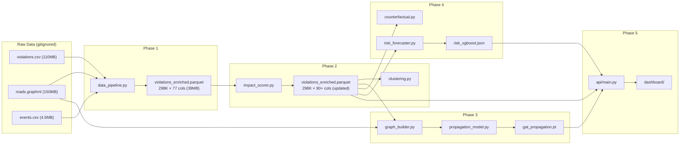

# DRISHTAM (दृष्टम्) — Project File Structure

> **Single source of truth** for all file and directory paths.  
> Every plan, module, and script MUST follow this structure.  
> Last updated: 2026-06-17 (Phase 2 in progress)

---

## Directory Tree

```
Gridlock project/
│
├── README.md                           # Project overview, setup, quickstart
├── pyproject.toml                      # Project metadata, tool configs (ruff, mypy, pytest)
├── .gitignore                          # Tracked exclusions (data, cache, venv, logs)
│
├── plans/                              # 📋 Design documents & phase plans
│   ├── README.md                       #   Plan overview & phase dependency map
│   ├── file_structure.md               #   THIS FILE — canonical path reference
│   ├── code_quality_standards.md       #   Ruff, Mypy, Bandit, testing, docstring conventions
│   ├── novel_enhancements.md           #   Novel layers: economic cost, carbon, equity, multi-modal
│   ├── phase1_data_foundation.md       #   ✅ Phase 1 plan (COMPLETE)
│   ├── phase2_impact_scoring.md        #   🔧 Phase 2 plan (IN PROGRESS)
│   ├── phase3_gnn_propagation.md       #   📝 Phase 3 plan
│   ├── phase4_whatif_and_forecasting.md #   📝 Phase 4 plan
│   └── phase5_dashboard_and_deployment.md # 📝 Phase 5 plan
│
├── drishtam/                           # 🐍 Core Python package (was "parkimpact" in early plans)
│   ├── __init__.py                     #   Package init, version, public API
│   ├── config.py                       #   All constants, paths, mappings, hyperparameters
│   ├── exceptions.py                   #   Custom exception hierarchy
│   ├── utils.py                        #   Shared helpers (coordinates, timer, I/O, validation)
│   │
│   │  # --- Phase 1: Data Foundation ---
│   ├── data_pipeline.py                #   ETL: load_violations(), load_road_network(),
│   │                                   #        load_events(), enrich_violations()
│   ├── verification.py                 #   Quality gates: verify_enriched_data(),
│   │                                   #        print_enrichment_summary()
│   │
│   │  # --- Phase 2: Impact Scoring ---
│   ├── impact_scorer.py                #   PIS engine: 6 components, compute_pis(),
│   │                                   #        economic cost, carbon impact, weight sensitivity
│   ├── clustering.py                   #   HDBSCAN: cluster_violations(),
│   │                                   #        characterize_clusters(), rank_enforcement_zones()
│   │
│   │  # --- Phase 3: GNN Propagation ---
│   ├── graph_builder.py                #   [FUTURE] OSM → PyG line graph, node/edge features,
│   │                                   #        training labels
│   ├── propagation_model.py            #   [FUTURE] ParkImpactGAT model, train/predict
│   │
│   │  # --- Phase 4: What-If & Forecasting ---
│   ├── counterfactual.py               #   [FUTURE] What-if simulation engine
│   └── risk_forecaster.py              #   [FUTURE] XGBoost/LightGBM risk prediction, SHAP
│
├── scripts/                            # 🚀 Executable pipeline scripts (numbered by phase)
│   ├── 01_build_enriched_data.py       #   Phase 1: Load → enrich → verify → save parquet + viz
│   ├── 02_compute_impact_scores.py     #   Phase 2: PIS → clustering → costs → viz
│   ├── 03_build_gnn_graph.py           #   [FUTURE] Phase 3: Build PyG graph + train GAT
│   ├── 04_whatif_scenarios.py          #   [FUTURE] Phase 4: Run counterfactual scenarios
│   ├── 05_train_risk_model.py          #   [FUTURE] Phase 4: Train risk forecaster
│   ├── 06_export_for_dashboard.py      #   [FUTURE] Phase 5: Export GeoJSON/tiles for dashboard
│   │
│   ├── run_phase1.py                   #   Cloud wrapper for Phase 1 (file-based logging)
│   ├── cloud_setup_and_run.sh          #   GCP VM setup automation
│   └── quality_check.py                #   Code quality runner (ruff, mypy, tests)
│
├── data/                               # 📊 Data directory (ALL files gitignored)
│   ├── bengaluru_roads.graphml         #   OSM road network (150 MB)
│   ├── violations_enriched.parquet     #   Phase 1 output → updated in Phase 2 with PIS
│   │                                   #        (298K rows × 77+ cols, ~39 MB)
│   ├── models/                         #   [FUTURE] Saved model checkpoints
│   │   ├── gat_propagation.pt          #   [FUTURE] Phase 3 GAT weights
│   │   ├── risk_xgboost.json           #   [FUTURE] Phase 4 risk model
│   │   └── risk_lightgbm.json          #   [FUTURE] Phase 4 risk model
│   └── dashboard/                      #   [FUTURE] Phase 5 pre-computed GeoJSON/tiles
│       ├── violations.geojson          #   [FUTURE]
│       ├── segments.geojson            #   [FUTURE]
│       └── clusters.geojson            #   [FUTURE]
│
├── research/                           # 📈 EDA outputs, charts, and research logs
│   ├── 01_violation_eda.md             #   EDA #1: Violation patterns (18 charts)
│   ├── 01_*.png                        #
│   ├── 02_event_eda.md                 #   EDA #2: Traffic events (20 charts)
│   ├── 02_*.png                        #
│   ├── 03_cross_dataset_analysis.md    #   EDA #3: Cross-dataset (12 charts)
│   ├── 03_*.png                        #
│   ├── 04_osm_road_network.md          #   EDA #4: Road network (10 charts)
│   ├── 04_*.png                        #
│   ├── 05_research_landscape.md        #   Literature review
│   ├── 06_enriched_data_summary.md     #   Phase 1: Enrichment summary (6 charts)
│   ├── 06_*.png                        #
│   ├── 07_parking_impact_scores.md     #   Phase 2: PIS report (15+ charts)
│   ├── 07_*.png                        #
│   ├── 08_gnn_propagation.md           #   [FUTURE] Phase 3: GNN results
│   ├── 08_*.png                        #
│   ├── 09_whatif_scenarios.md          #   [FUTURE] Phase 4: What-if results
│   ├── 09_*.png                        #
│   └── 10_risk_forecasting.md          #   [FUTURE] Phase 4: Risk model results
│
├── api/                                # 🌐 [FUTURE] Phase 5: FastAPI backend
│   ├── main.py                         #   [FUTURE] App entry, CORS, middleware
│   ├── routes/                         #   [FUTURE]
│   │   ├── dashboard.py                #   [FUTURE] KPI endpoints
│   │   ├── impact.py                   #   [FUTURE] Violation/segment queries
│   │   ├── whatif.py                   #   [FUTURE] Simulation endpoints
│   │   ├── forecast.py                 #   [FUTURE] Risk prediction endpoints
│   │   └── clusters.py                 #   [FUTURE] Cluster query endpoints
│   └── data_loader.py                  #   [FUTURE] Parquet/model loading for API
│
├── dashboard/                          # 🎨 [FUTURE] Phase 5: Next.js frontend
│   ├── package.json                    #   [FUTURE]
│   ├── src/                            #   [FUTURE]
│   │   ├── app/                        #   [FUTURE] Pages (Next.js App Router)
│   │   ├── components/                 #   [FUTURE] React components
│   │   └── lib/                        #   [FUTURE] API client, utils
│   └── public/                         #   [FUTURE] Static assets
│
├── tests/                              # 🧪 [FUTURE] Test suite
│   ├── test_data_pipeline.py           #   [FUTURE] Phase 1 tests
│   ├── test_impact_scorer.py           #   [FUTURE] Phase 2 tests
│   ├── test_clustering.py              #   [FUTURE] Phase 2 tests
│   ├── test_graph_builder.py           #   [FUTURE] Phase 3 tests
│   └── conftest.py                     #   [FUTURE] Shared fixtures
│
└── cache/                              # 🗄️ Runtime caches (gitignored)
    └── (auto-generated)
```

---

## Naming Conventions

| Category | Convention | Example |
|----------|-----------|---------|
| **Package** | `drishtam/` (not `parkimpact/`) | `drishtam/impact_scorer.py` |
| **Scripts** | `NN_snake_case.py` (numbered by phase) | `scripts/02_compute_impact_scores.py` |
| **Research** | `NN_snake_case.{md,png}` (numbered by EDA/phase) | `research/07_pis_distribution.png` |
| **Data** | `snake_case.{parquet,graphml,geojson}` | `data/violations_enriched.parquet` |
| **Models** | `snake_case.{pt,json}` | `data/models/gat_propagation.pt` |
| **Plans** | `phaseN_topic.md` | `plans/phase3_gnn_propagation.md` |
| **Tests** | `test_module_name.py` | `tests/test_impact_scorer.py` |

---

## Key Path Mappings

> ⚠️ **IMPORTANT**: Early plan files referenced `parkimpact/`. The actual package name is **`drishtam/`**.

| Plan Reference | Actual Path | Notes |
|---------------|-------------|-------|
| `parkimpact/data_pipeline.py` | `drishtam/data_pipeline.py` | Phase 1 core |
| `parkimpact/config.py` | `drishtam/config.py` | All constants |
| `parkimpact/utils.py` | `drishtam/utils.py` | Shared helpers |
| `parkimpact/impact_scorer.py` | `drishtam/impact_scorer.py` | Phase 2 PIS |
| `parkimpact/clustering.py` | `drishtam/clustering.py` | Phase 2 HDBSCAN |
| `parkimpact/graph_builder.py` | `drishtam/graph_builder.py` | Phase 3 (future) |
| `parkimpact/propagation_model.py` | `drishtam/propagation_model.py` | Phase 3 (future) |
| `parkimpact/counterfactual.py` | `drishtam/counterfactual.py` | Phase 4 (future) |
| `parkimpact/risk_forecaster.py` | `drishtam/risk_forecaster.py` | Phase 4 (future) |

---

## Data Flow



---

## Phase → File Mapping

| Phase | Module Files | Script | Research Output |
|-------|-------------|--------|-----------------|
| **1** ✅ | `data_pipeline.py`, `verification.py`, `utils.py`, `config.py` | `01_build_enriched_data.py` | `06_*.{md,png}` |
| **2** 🔧 | `impact_scorer.py`, `clustering.py` | `02_compute_impact_scores.py` | `07_*.{md,png}` |
| **3** 📝 | `graph_builder.py`, `propagation_model.py` | `03_build_gnn_graph.py` | `08_*.{md,png}` |
| **4** 📝 | `counterfactual.py`, `risk_forecaster.py` | `04_whatif_scenarios.py`, `05_train_risk_model.py` | `09_*.{md,png}`, `10_*.{md,png}` |
| **5** 📝 | `api/`, `dashboard/` | `06_export_for_dashboard.py` | — |

---

## Git Tracking Rules

| Directory/Pattern | Tracked? | Reason |
|-------------------|----------|--------|
| `drishtam/*.py` | ✅ Yes | Core source code |
| `scripts/*.py` | ✅ Yes | Pipeline scripts |
| `plans/*.md` | ✅ Yes | Design documents |
| `research/*.md` | ✅ Yes | Research reports |
| `research/*.png` | ✅ Yes | Visualizations |
| `data/*.parquet` | ❌ No | Too large (39MB+) |
| `data/*.graphml` | ❌ No | Too large (150MB) |
| `data/*.csv` | ❌ No | Too large (110MB) |
| `data/models/*` | ❌ No | Model checkpoints |
| `cache/` | ❌ No | Runtime caches |
| `.venv/` | ❌ No | Virtual environment |
| `*.log` | ❌ No | Logs |
