# EDA #1: Parking Violation Data — Deep Analysis

> **Dataset**: `jan to may police violation_anonymized791b166.csv`  
> **Records**: 298,445 (after dropping 5 NaT rows)  
> **Period**: Nov 9, 2023 → Apr 8, 2024 (150 days)  
> **City**: Bengaluru, Karnataka, India  

---

## 1. Data Quality Summary

| Field | Completeness | Notes |
|---|---|---|
| id, lat, lon, vehicle_number, vehicle_type, violation_type | **100%** | Core fields are solid |
| location (address) | 99.0% | Only 3K missing |
| police_station, junction_name | 100% | Excellent |
| validation_status | **58.0%** | 42% unvalidated — significant gap |
| description | **0%** | Completely empty — unused field |
| closed_datetime | **0%** | No case closures tracked |
| action_taken_timestamp | **0%** | No enforcement follow-up tracked |

**Key insight**: The data captures *detection* well but has zero follow-through data. No `closed_datetime`, no `action_taken_timestamp`. This means we can map where violations are detected but NOT whether enforcement action was taken. This is itself a finding worth presenting.

---

## 2. Violation Types

### Primary violations (exploded from multi-violation records):
| Violation Type | Count | % of Records |
|---|---|---|
| **WRONG PARKING** | 164,974 | 55.3% |
| **NO PARKING** | 139,048 | 46.6% |
| PARKING IN A MAIN ROAD | 23,943 | 8.0% |
| DEFECTIVE NUMBER PLATE | 7,847 | 2.6% |
| PARKING ON FOOTPATH | 3,757 | 1.3% |
| PARKING NEAR BUSTOP/SCHOOL/HOSPITAL | 2,403 | 0.8% |
| DOUBLE PARKING | 2,037 | 0.7% |
| PARKING NEAR ROAD CROSSING | 1,687 | 0.6% |

**Finding**: "WRONG PARKING" and "NO PARKING" dominate at 55% and 47% respectively. The totals exceed 100% because 13.4% of records (40,109) have **multiple violations tagged simultaneously** — a rich signal for severity scoring.

### Congestion-relevant violations:
These are the ones that directly choke carriageways:
- **PARKING IN A MAIN ROAD** (23,943) — directly blocks traffic lanes
- **DOUBLE PARKING** (2,037) — forces lane narrowing
- **PARKING NEAR ROAD CROSSING** (1,687) — blocks intersection sightlines
- **PARKING NEAR BUSTOP/SCHOOL/HOSPITAL** (2,403) — blocks high-traffic zones

**Total congestion-relevant**: ~30,070 records (10.1%) — these are the highest-impact violations for our use case.

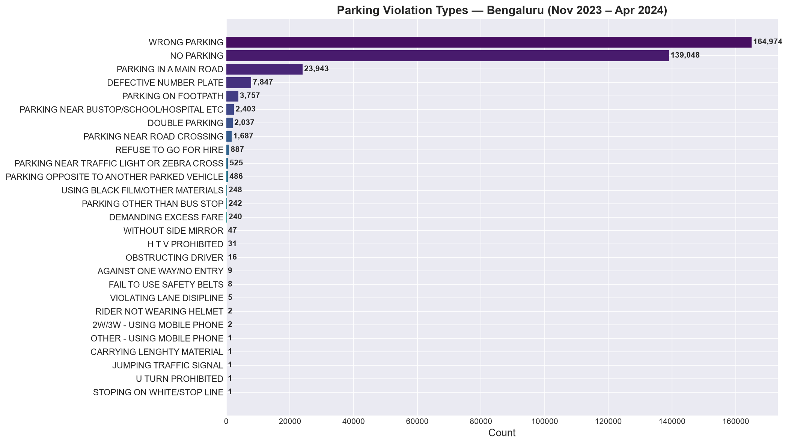
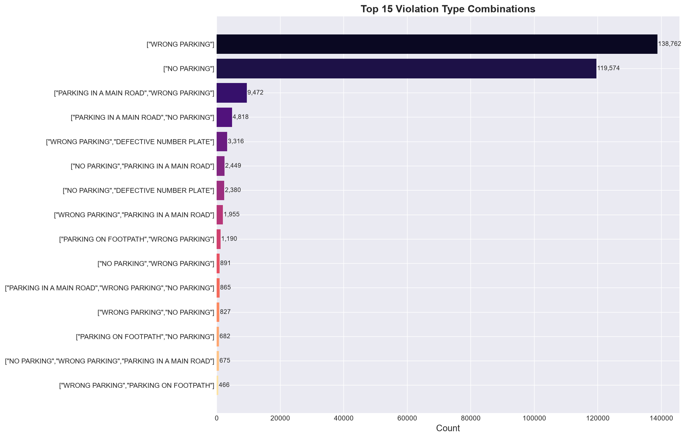

---

## 3. Temporal Patterns — CRITICAL FINDING

### Hourly Pattern (UTC timestamps — note +5:30 IST offset):

The timestamps are in UTC. Adding 5:30 hours for IST:

| UTC Hour | IST Equivalent | Violations | Interpretation |
|---|---|---|---|
| 00:00 | **05:30 AM** | 21,760 | Early morning enforcement starts |
| 02:00 | **07:30 AM** | 24,770 | Morning rush begins |
| 03:00 | **08:30 AM** | 25,707 | Peak commercial area parking |
| **05:00** | **10:30 AM** | **34,085** | **PEAK — mid-morning commercial** |
| 06:00 | **11:30 AM** | 26,890 | Late morning |
| 07:00 | **12:30 PM** | 14,608 | Lunch hour drop |
| 10:00–15:00 | 3:30–8:30 PM | ~50–500 | **Near-zero enforcement** |
| 19:00 | **00:30 AM** | 10,713 | Night parking buildup |
| 21:00 | **02:30 AM** | 19,763 | Overnight parking |
| 23:00 | **05:30 AM** | 22,861 | Pre-dawn enforcement |

**CRITICAL FINDING**: There's a **massive enforcement gap from ~3:30 PM to 8:30 PM IST** (the evening rush hour). This is exactly when traffic congestion is worst but parking enforcement drops to near-zero. This is a key actionable insight.

### Day of Week:
- **Sunday has the MOST violations** — counterintuitive! Likely because enforcement catches overnight/parked vehicles on low-traffic days
- Weekdays are relatively uniform

### Monthly:
- **January is peak** (65,813) — post-holiday enforcement surge?
- **April is lowest** (15,082) — only partial month in data

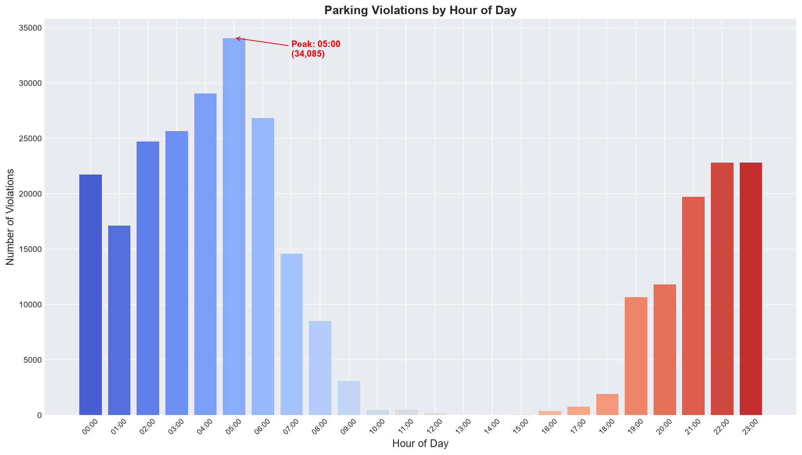
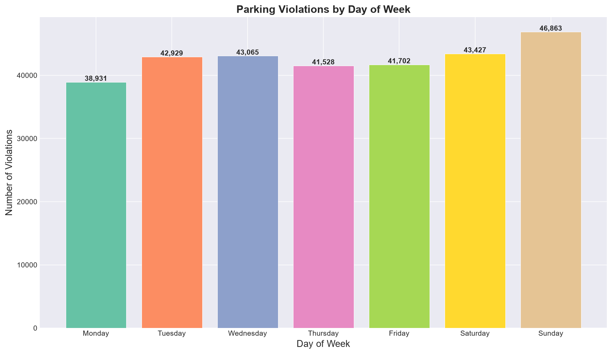
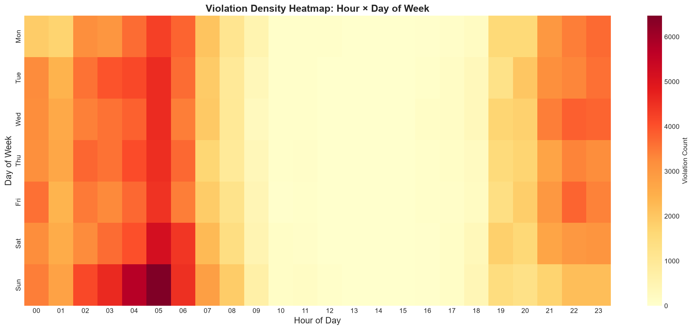
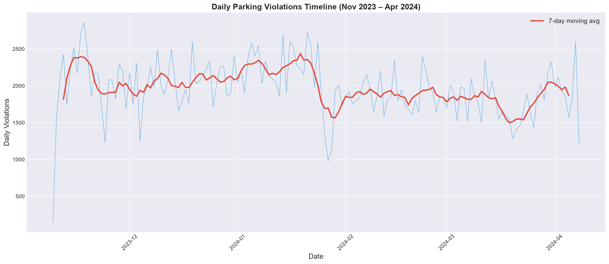
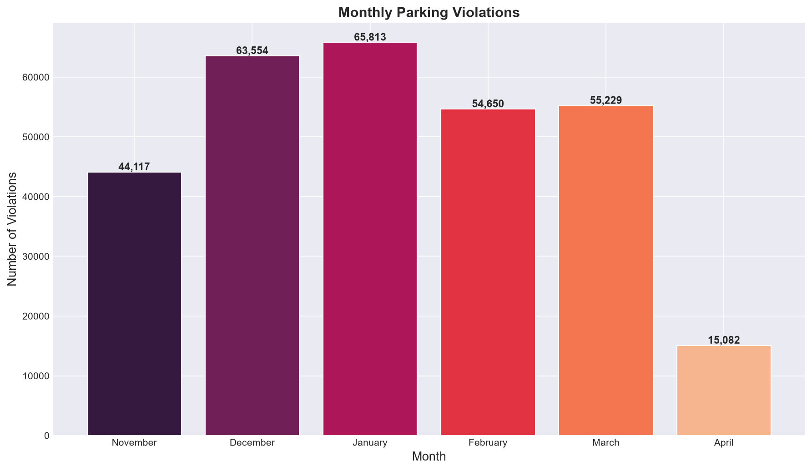

---

## 4. Vehicle Types

| Vehicle Type | Count | % |
|---|---|---|
| **SCOOTER** | 94,856 | 31.8% |
| **CAR** | 88,868 | 29.8% |
| **MOTOR CYCLE** | 40,811 | 13.7% |
| **PASSENGER AUTO** | 37,813 | 12.7% |
| MAXI-CAB | 11,372 | 3.8% |
| LGV | 8,254 | 2.8% |

**Finding**: Two-wheelers (scooter + motorcycle + moped) = **46.2%** of violations. Cars = 29.8%. This matters for congestion impact — a car illegally parked on a main road blocks far more carriageway than a scooter parked on the footpath.

**Congestion weighting idea**: Weight violations by vehicle footprint:
- Car/Maxi-cab/LGV/HGV → High impact (occupy full lane width)
- Auto → Medium impact
- Scooter/Motorcycle → Low impact (unless on carriageway)

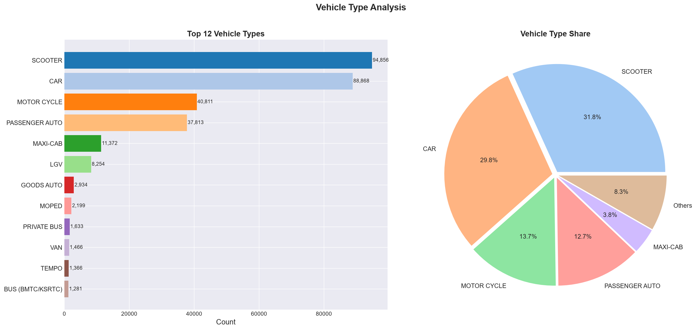

---

## 5. Police Station Rankings

| Rank | Station | Violations | Zone |
|---|---|---|---|
| 1 | **Upparpet** | 34,468 | Central (commercial hub) |
| 2 | **Shivajinagar** | 28,044 | Central (commercial) |
| 3 | **Malleshwaram** | 22,200 | West (market area) |
| 4 | **HAL Old Airport** | 20,819 | East (ORR corridor) |
| 5 | **City Market** | 17,646 | Central (KR Market) |
| 6 | **Vijayanagara** | 14,652 | West |
| 7 | **Rajajinagar** | 10,998 | West |
| 8 | **Kodigehalli** | 10,916 | North |
| 9 | **Magadi Road** | 8,558 | West |
| 10 | **Jeevanbheemanagar** | 6,736 | East |

**Finding**: Top 5 stations account for **41.3%** of all violations. These are all **commercial/market areas** in central Bengaluru. The distribution is heavily skewed (mean=5,527, median=3,294, std=7,021).

**Interesting**: Upparpet alone has **6.2x** the violations of the median station. This could mean:
- Genuinely worse parking, OR
- More active enforcement/more cameras, OR
- Both

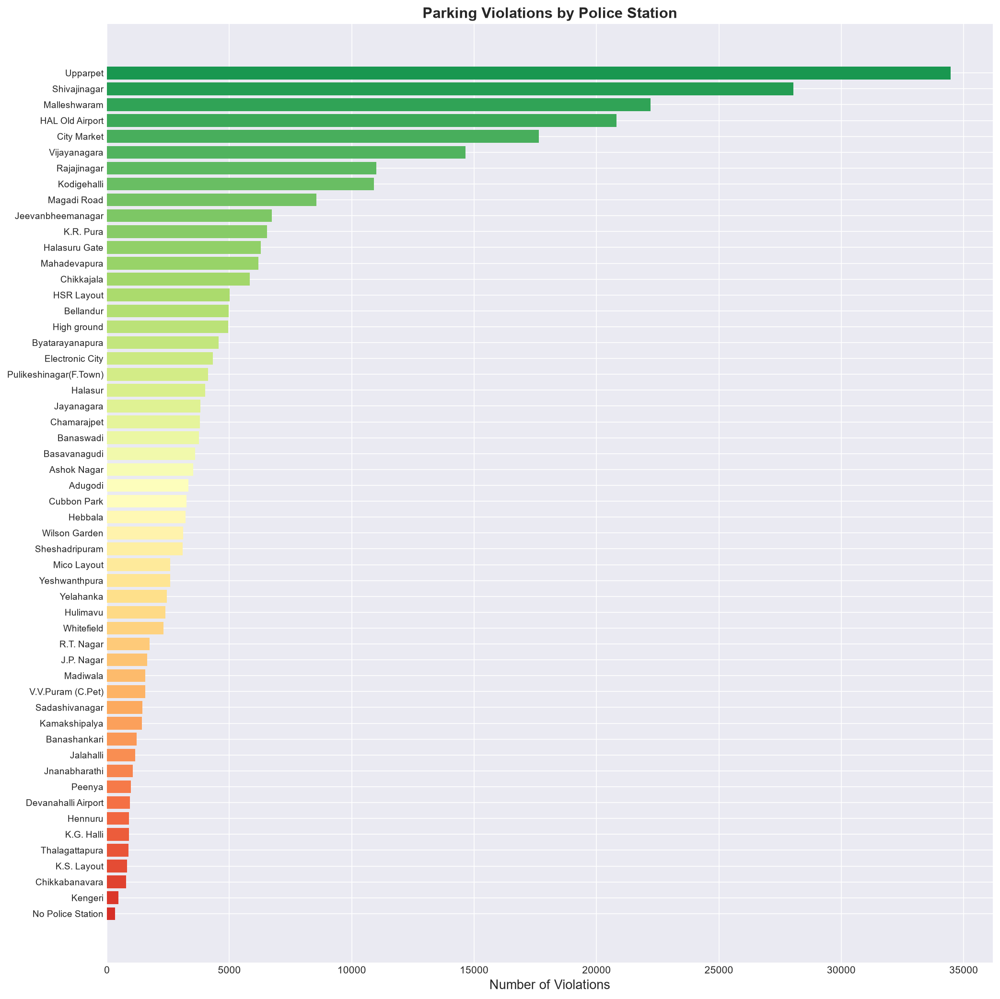
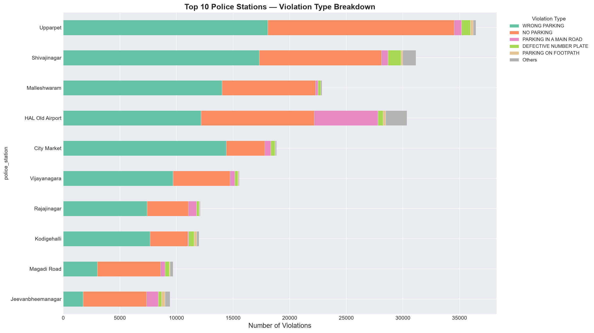

---

## 6. Spatial Distribution

### Density Map
The hexbin density map shows a clear **concentric pattern** centered on central Bengaluru (~12.97°N, 77.58°E), with the densest clusters along:
- **Upparpet / KR Market corridor** (highest single hotspot)
- **Shivajinagar / Commercial Street area**
- **ORR East (Kadubisanahalli – Bellandur)** — secondary hotspot
- **Rajajinagar / Modi Bridge area**

### Top 5 Hotspot Coordinates:
1. **(12.9995, 77.5496)** — 119 violations — Rajajinagar, Modi Bridge Junction
2. **(12.8763, 77.5965)** — 97 violations — JP Nagar / Bannerghatta Road
3. **(12.9341, 77.6898)** — 82 violations — Kadubisanahalli, ORR
4. **(12.9992, 77.5486)** — 80 violations — Rajajinagar
5. **(12.9991, 77.5496)** — 67 violations — Rajajinagar (cluster)

**Finding**: Hotspots #1, #4, #5 are within **100 meters of each other** near Modi Bridge Junction — this is a persistent, concentrated problem zone.

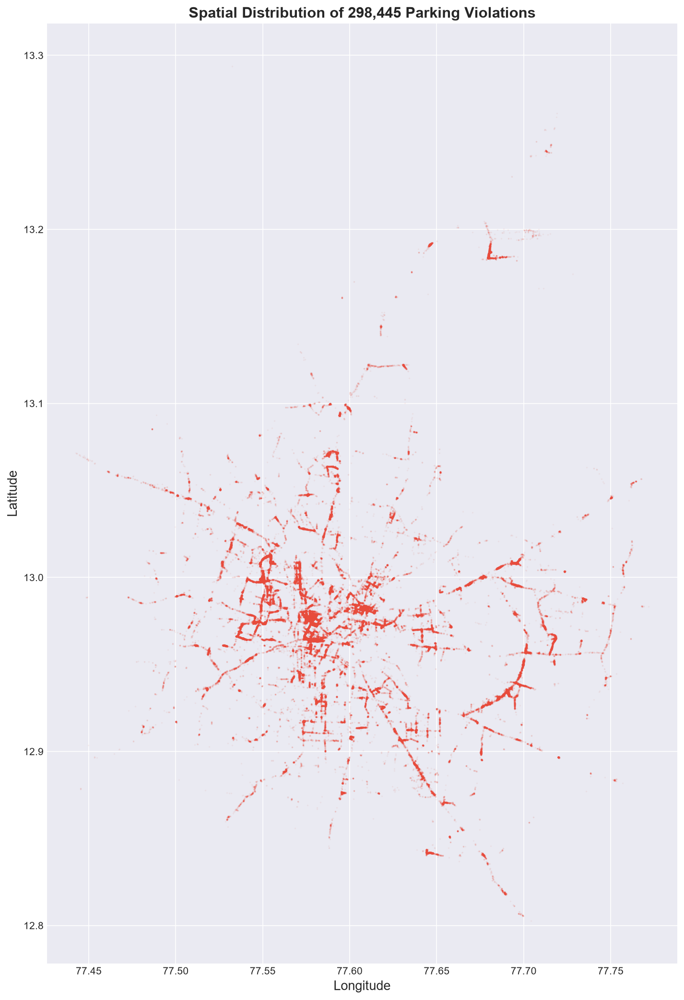
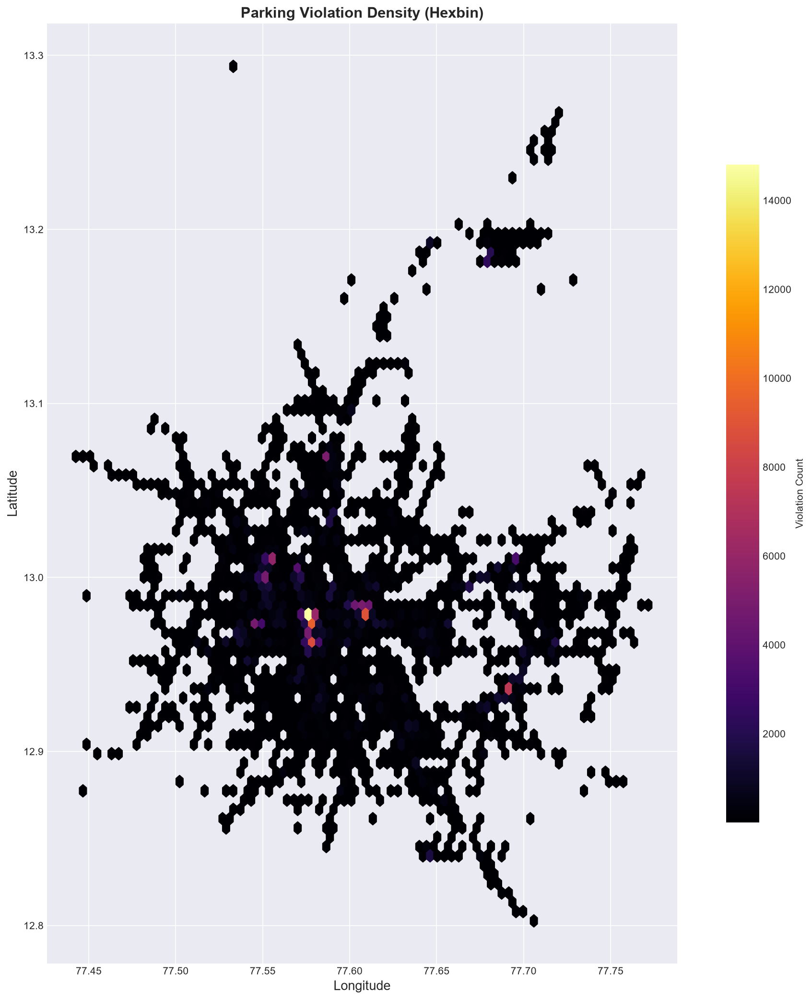
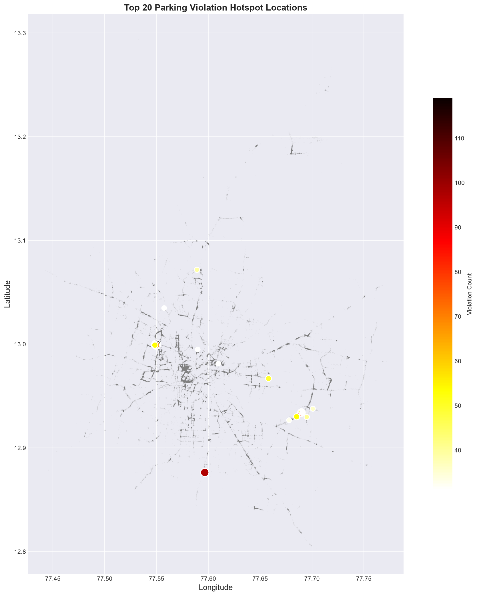

---

## 7. Junction Analysis

50.4% of records (150,565) have a specific junction tagged. Top junctions:

| Junction | Violations | Area |
|---|---|---|
| **BTP051 - Safina Plaza** | 15,449 | Shivajinagar |
| **BTP082 - KR Market** | 11,538 | City Market |
| **BTP040 - Elite** | 10,718 | Upparpet |
| **BTP044 - Sagar Theatre** | 10,549 | Upparpet |
| BTP211 - Central Street | 5,388 | Upparpet |

**Finding**: Top 4 junctions alone = 48,254 violations (32% of all junction-tagged records). These are all major commercial intersections known for heavy pedestrian and vehicle traffic.

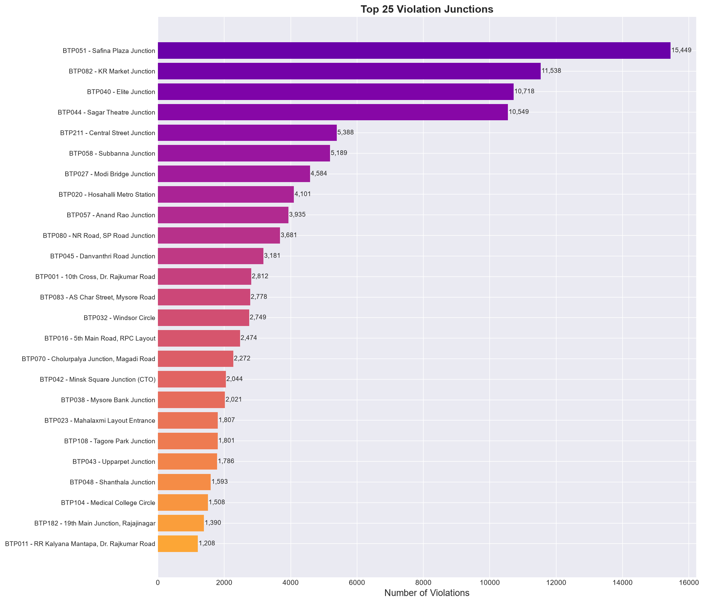

---

## 8. Validation & Enforcement Quality

Of records with validation status (58% of total):
- **Approved**: 115,400 (66.6%)
- **Rejected**: 49,754 (28.7%)
- **Other** (created1/processing/duplicate): 8,042 (4.6%)

**Finding**: A **28.7% rejection rate** is surprisingly high. This means almost 1 in 3 violations flagged by cameras/officers is later rejected. Possible causes:
- False positives from automated camera detection
- Incorrect vehicle number plate reading
- Vehicle was authorized to park there

**Implication for our model**: We should filter to `approved` violations only for spatial analysis, or at minimum weight approved higher than unvalidated.

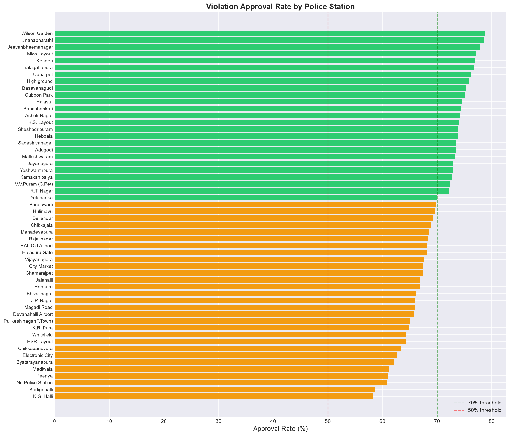

---

## 9. Repeat Offenders

| Category | Unique Vehicles |
|---|---|
| 1 violation | 196,305 (84.7%) |
| 2 violations | 23,733 (10.2%) |
| 3-5 violations | 9,500 (4.1%) |
| 6-10 violations | 1,800 (0.8%) |
| **11+ violations** | **552 (0.2%)** |

- **Most cited vehicle**: 55 violations across the period
- **15.3%** of vehicles are repeat offenders (2+ violations)
- These 35,585 repeat offenders generate a disproportionate share of violations

**Finding**: Repeat offenders represent a **targeted enforcement opportunity**. If the top 552 chronic offenders (11+ violations) were addressed, it could eliminate thousands of violation-hours from high-congestion zones.

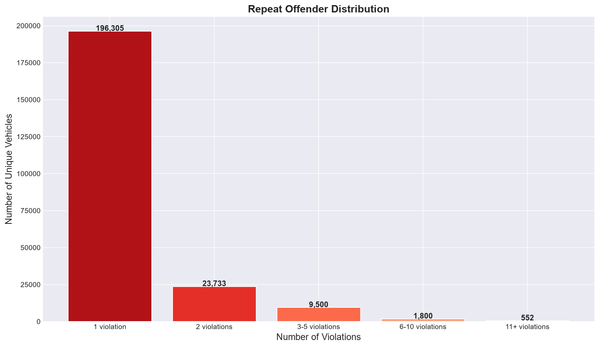
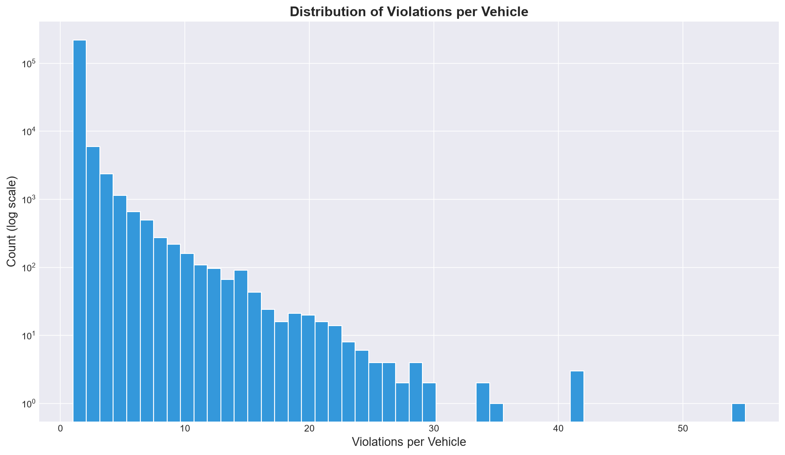

---

## 10. Enforcement Devices

- **3,070 unique devices** — mix of CCTV cameras and handheld devices
- Top device: FKDEV00021 with 4,344 captures
- **Extremely skewed**: Mean=97, Median=16 — a few devices do most of the work
- Suggests enforcement coverage is very uneven — some areas have active cameras, most don't

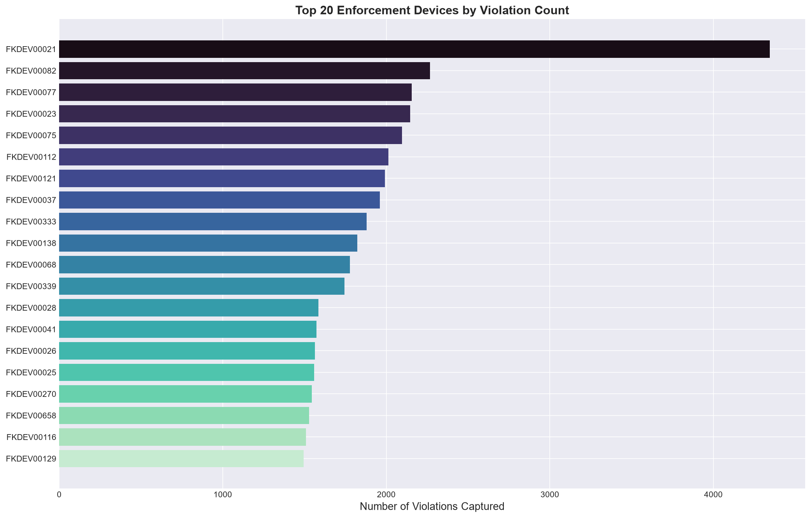

---

## Key Takeaways for the Project

### 🔑 Finding 1: Enforcement Gap During Evening Rush
The biggest violation detection window is 5:30 AM – 12:30 PM IST. Evening rush (3:30 – 8:30 PM) has near-zero enforcement despite being the worst congestion period. **This is the #1 actionable recommendation**.

### 🔑 Finding 2: Concentrated Hotspots
5 junctions generate 32% of all tagged violations. These are known commercial hubs (Safina Plaza, KR Market, Elite Junction, Sagar Theatre). **Direct targeting of these 5 junctions could address a third of the problem**.

### 🔑 Finding 3: High Rejection Rate
28.7% of violations are rejected — automated detection quality needs improvement, OR the validation process is too strict.

### 🔑 Finding 4: Two-Wheeler Dominance ≠ Congestion Impact
46% of violations are two-wheelers, but their congestion impact is much lower than the 30% that are cars/cabs. **Our impact model should weight by vehicle size**.

### 🔑 Finding 5: Zero Enforcement Follow-Through Data
`closed_datetime` and `action_taken_timestamp` are 100% empty. The system detects but doesn't close the loop. **This is a systemic weakness worth highlighting**.

### 🔑 Finding 6: Repeat Offenders Are Targetable
552 vehicles with 11+ violations represent chronic, predictable violations. A focused crackdown list could be generated.

---

## Next Steps
- [ ] Run Event Data EDA (02) to find the other side of the story — congestion events
- [ ] Cross-reference violation hotspots with congestion event locations
- [ ] Test hypothesis: "High-violation zones have higher congestion event rates"
