# EDA #2: Traffic Event / Incident Data — Deep Analysis

> **Dataset**: `Astram event data_anonymized - Astram event data_anonymizedb40ac87.csv`  
> **Records**: 8,057  
> **Period**: Nov 9, 2023 → Apr 8, 2024 (150 days)  
> **City**: Bengaluru, Karnataka, India  
> **Source**: BTPMS (Bengaluru Traffic Police Management System / Astram)

---

## 1. Data Quality Summary

The event dataset is significantly richer than the violation data — it has event lifecycle tracking (start → close → resolve).

| Notable Gaps | Completeness |
|---|---|
| `veh_type` | ~60% — only breakdowns have vehicle type |
| `description` | 83.1% — rich text data with Kannada + English |
| `closed_datetime` | ~37% — many events still active/unclosed |
| `requires_road_closure` | 100% — great for impact analysis |

**Key difference from violation data**: Events have `closed_datetime` and `resolved_datetime` — we can calculate actual **duration of disruption**. This is exactly what we need for congestion impact quantification.

---

## 2. Event Cause Breakdown — CRITICAL FINDING

| Cause | Count | % | Congestion Impact |
|---|---|---|---|
| **vehicle_breakdown** | **4,886** | **60.6%** | HIGH — blocks lanes |
| others | 636 | 7.9% | Mixed |
| pot_holes | 537 | 6.7% | MEDIUM — slows traffic |
| water_logging | 458 | 5.7% | HIGH — road closure |
| construction | 438 | 5.4% | HIGH — lane narrowing |
| **accident** | **365** | **4.5%** | HIGH — full closure |
| tree_fall | 284 | 3.5% | HIGH — road blockage |
| road_conditions | 170 | 2.1% | MEDIUM |
| **congestion** | **136** | **1.7%** | — (is the effect itself) |
| procession | 66 | 0.8% | HIGH — road closure |
| public_event | 45 | 0.6% | MEDIUM |
| protest | 14 | 0.2% | HIGH |
| vip_movement | 4 | 0.05% | LOW (short duration) |

### CRITICAL FINDING: Vehicle breakdowns dominate at 60.6%

This is NOT a "public event" dataset as originally assumed. It's primarily a **reactive incident log**. The data tells us:
- **60.6% of all traffic disruption events are vehicle breakdowns** — this is massive
- Only **1.7% are labelled "congestion"** (136 events)
- Only **0.6% are public events** (45 events)

**Implication for our problem statement**: This data does NOT directly capture "parking-induced congestion". Instead, it captures the *effects* of traffic disruptions. We need to **correlate this with the violation data spatially** to find whether high-violation areas also have high event rates.

### Planned vs Unplanned
- **Unplanned**: 7,692 (95.5%) — reactive incidents
- **Planned**: 365 (4.5%) — likely construction, public events, processions

### Road Closure Flag
- **596 events required road closure** (7.4%)
- These are the highest-impact events for congestion analysis

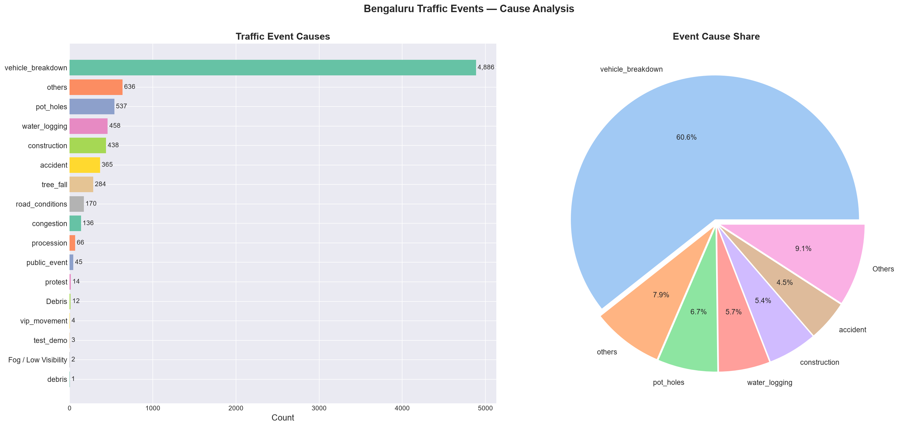
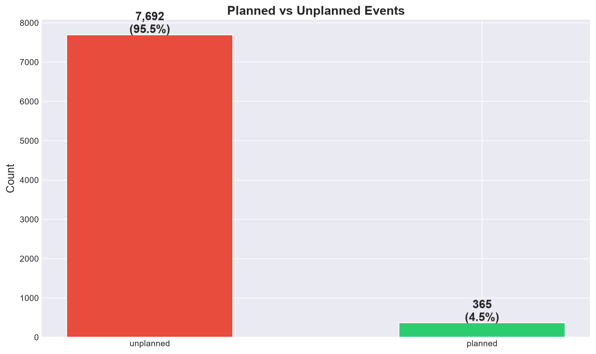

---

## 3. Temporal Patterns

### Hourly (UTC → IST)
The event data shows a **bimodal pattern** — two peaks:
- **Peak 1**: UTC 04:00–07:00 (IST 9:30 AM – 12:30 PM) — morning rush incidents
- **Peak 2**: UTC 19:00–22:00 (IST 12:30 AM – 3:30 AM) — late night/overnight reports

**Interesting contrast with violation data**: Violation peak is 05:00 UTC (10:30 AM IST). Event peak is 06:00 UTC (11:30 AM IST). Events lag violations by ~1 hour — consistent with "parking violation → disruption" causality (parking causes disruption with a delay).

### Day of Week
- **Thursday and Saturday are peak event days**
- Sunday is lowest — likely lower traffic volume reduces incidents
- This contrasts with violation data where Sunday is peak (enforcement catches overnight parking)

### Monthly
- Pattern roughly mirrors violation data
- January/February peak — same as violations

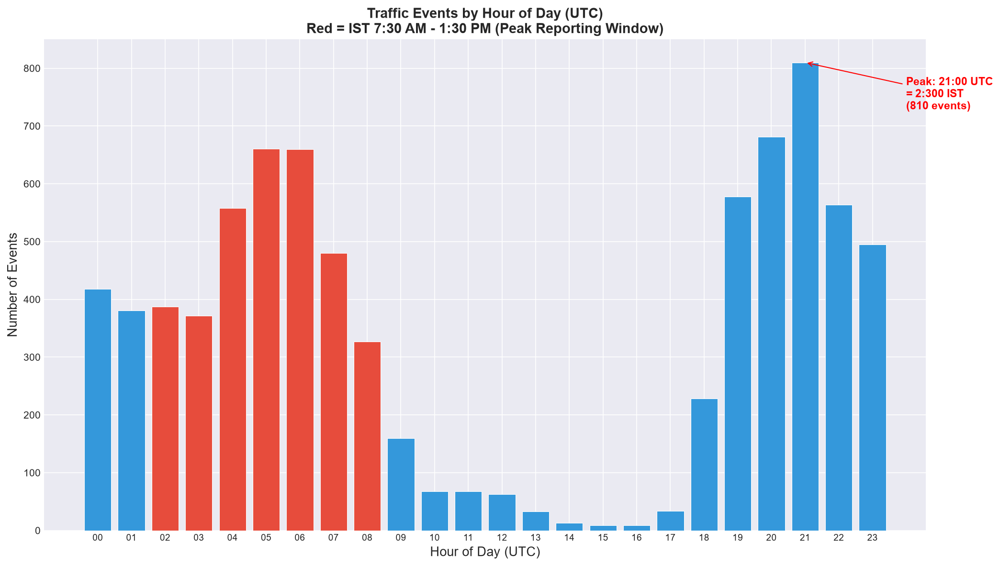
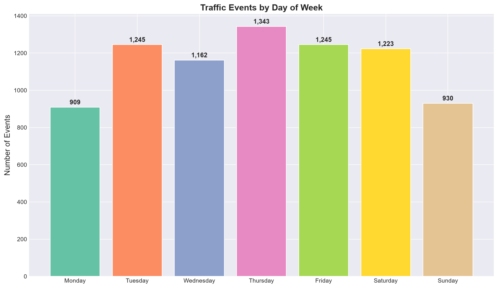
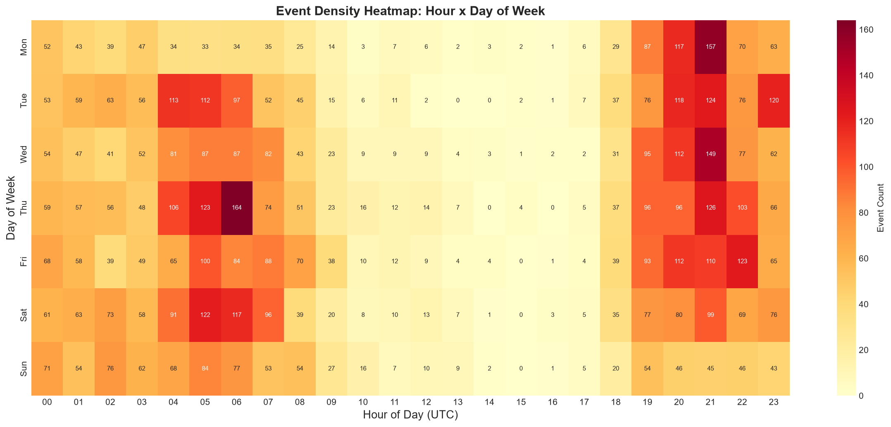
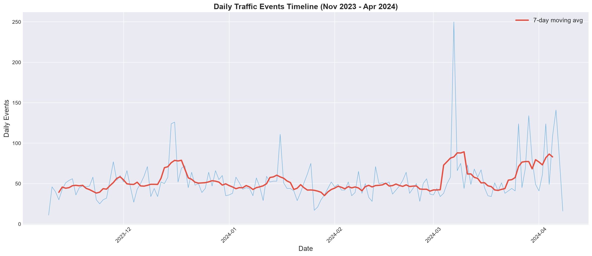
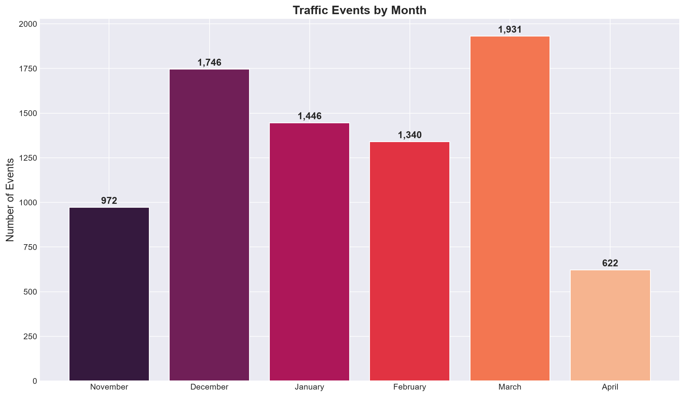

---

## 4. Duration Analysis — Key for Impact Scoring

### Overall Duration Stats (hours):
| Metric | Value |
|---|---|
| Mean | 41.5h |
| **Median** | **1.0h** |
| P90 | 143.0h |
| Max | 700.5h |

### Duration by Cause (Median hours):
| Cause | Median Duration | Impact |
|---|---|---|
| road_conditions | **103.8h** (~4.3 days) | Chronic — ongoing degraded road |
| pot_holes | **96.4h** (~4.0 days) | Chronic — infrastructure issue |
| water_logging | **45.9h** (~1.9 days) | Multi-day during rain events |
| construction | **31.6h** (~1.3 days) | Planned disruption |
| tree_fall | **10.4h** | Weather-related, clearance time |
| others | 4.0h | Miscellaneous |
| **congestion** | **1.2h** | Short-lived traffic jam |
| **vehicle_breakdown** | **0.7h** (~42 min) | Quick resolution |
| **accident** | **0.7h** (~42 min) | Quick resolution |
| procession | 0.6h | Very short impact |

### FINDING: Two Tiers of Disruption
1. **Acute events** (breakdown, accident, congestion): Median ~1 hour — high frequency, short duration
2. **Chronic events** (road conditions, potholes, water logging, construction): Median 30–100+ hours — low frequency, long duration

**For our congestion impact model**: We should weight by `frequency × duration × lane_blockage` to get true "congestion-hours" per zone.

**Formula**: `Congestion_Impact = Σ (event_count × median_duration_hours × severity_weight)`

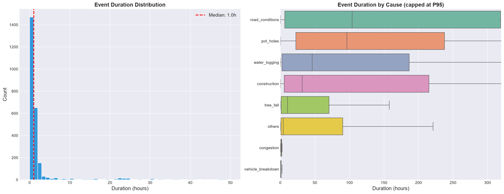

---

## 5. Vehicle Breakdown Deep Dive (4,886 events)

Since breakdowns are 60.6% of all events, they deserve special attention:

| Vehicle Type | Count | % of Breakdowns |
|---|---|---|
| **BMTC Bus** | 1,464 | 30.0% |
| Heavy Vehicle | 962 | 19.7% |
| LCV | 676 | 13.8% |
| Others | 449 | 9.2% |
| Private Bus | 358 | 7.3% |
| Private Car | 344 | 7.0% |
| Truck | 276 | 5.6% |
| KSRTC Bus | 217 | 4.4% |
| Taxi | 95 | 1.9% |
| Auto | 36 | 0.7% |

### FINDING: BMTC Buses Are the #1 Source of Breakdowns

30% of all vehicle breakdowns are **BMTC (public transport) buses**. Combined with heavy vehicles and trucks, large vehicles account for **70% of breakdowns**. These are also the vehicles that cause the most lane blockage — a broken-down bus blocks an entire lane.

**Actionable insight**: BMTC fleet maintenance quality directly impacts city-wide traffic congestion.

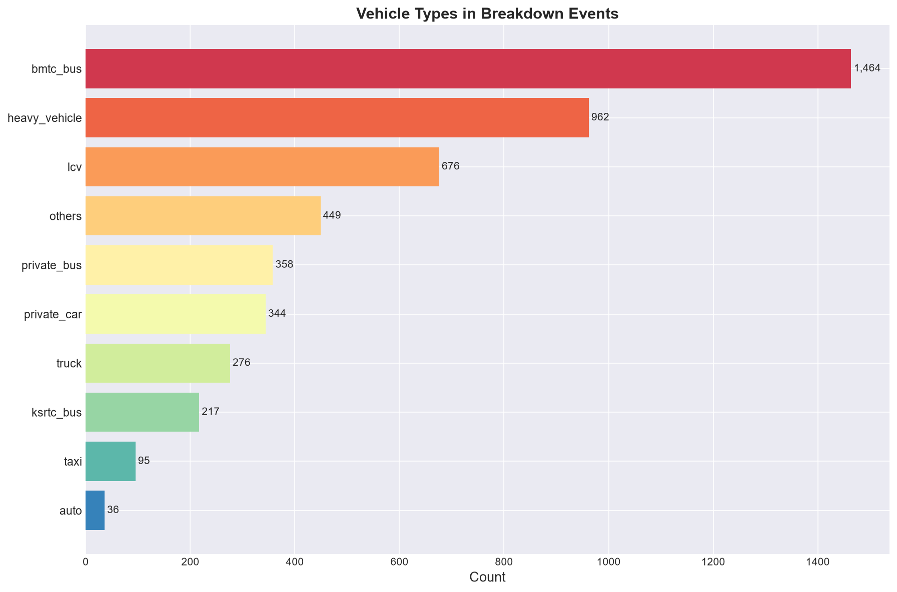

---

## 6. Corridor Analysis

The event data has explicit corridor labeling — 22 unique corridors:

| Corridor | Events | Key Issue |
|---|---|---|
| Non-corridor | 3,064 | Internal roads |
| **Mysore Road** | 728 | Most event-prone corridor |
| **Bellary Road 1** | 607 | North arterial |
| **Tumkur Road** | 458 | Northwest arterial |
| **Bellary Road 2** | 379 | North extension |
| **Hosur Road** | 297 | South arterial (IT corridor) |
| ORR North 1 | 274 | Ring road segment |
| Old Madras Road | 257 | East arterial |
| Magadi Road | 243 | West arterial |

### Top Congestion+Accident Corridors:
| Corridor | Congestion+Accident Events |
|---|---|
| ORR North 2 | 43 |
| Bellary Road 2 | 42 |
| ORR North 1 | 31 |
| Hennur Main Road | 25 |

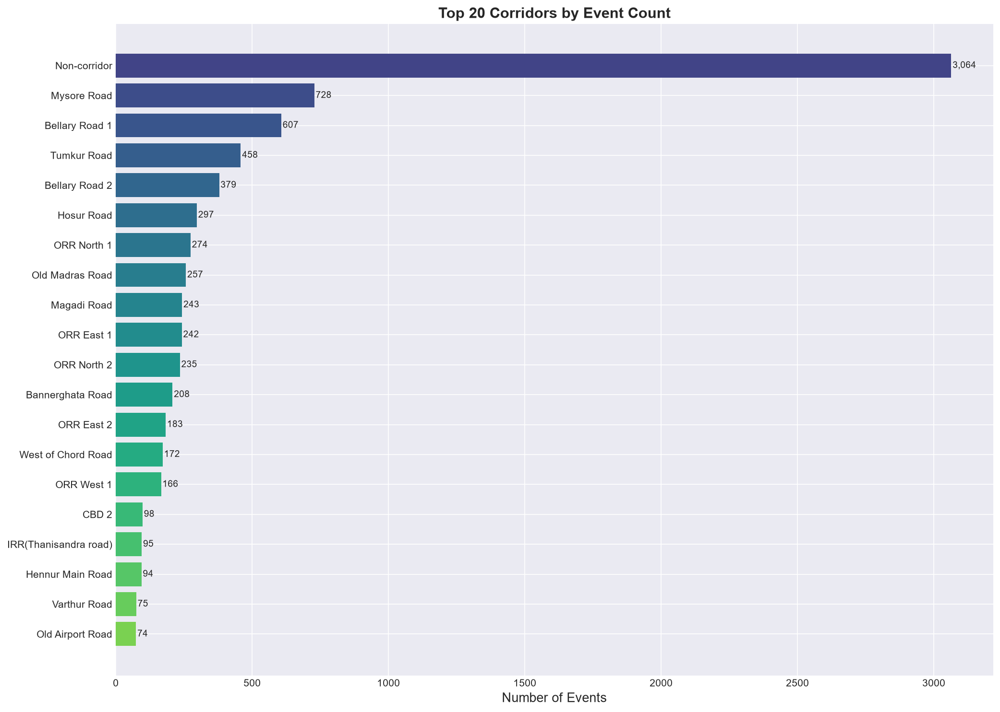
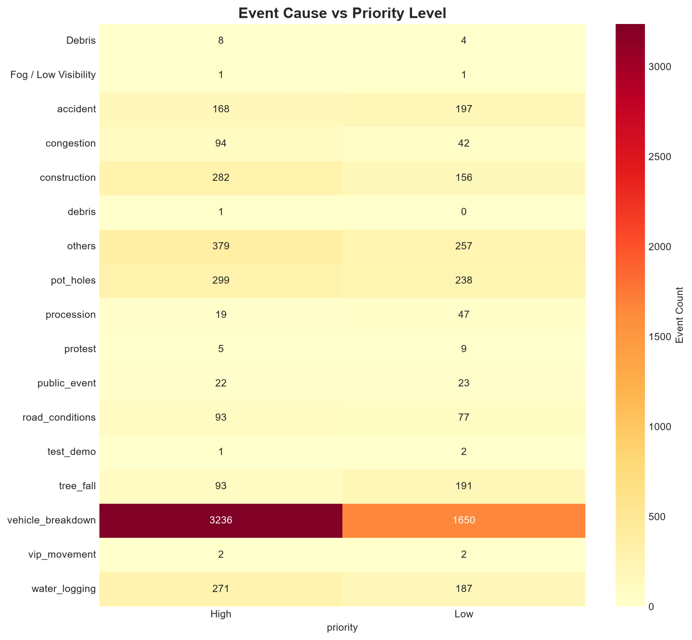

---

## 7. Police Station & Zone Analysis

### Top Event Stations:
| Station | Events | Also High Violation? |
|---|---|---|
| **Yelahanka** | 377 | No — different zone |
| **HAL Old Airport** | 354 | **YES** (#4 in violations) |
| Sadashivanagar | 301 | No |
| Byatarayanapura | 296 | No |
| Halasuru Gate | 294 | No |
| Yeshwanthpura | 279 | No |

**FINDING**: The event and violation station rankings are DIFFERENT. The top violation stations (Upparpet, Shivajinagar, Malleshwaram) are NOT the top event stations. Exception: **HAL Old Airport appears in both top-5 lists** — this is a strong candidate for parking-congestion correlation.

### Zone Distribution:
- Central Zone 2 leads with 604 events
- Distribution is more even than violations (which are heavily concentrated in central areas)

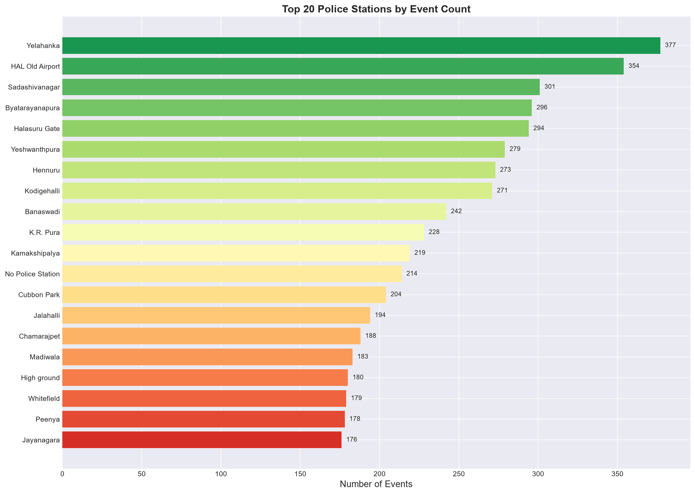
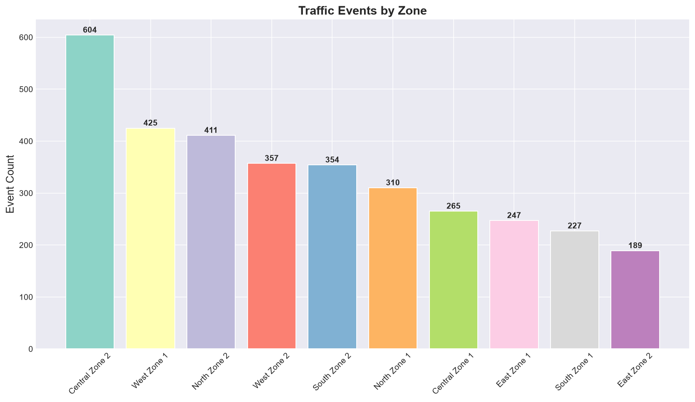

---

## 8. Spatial Distribution

The event density map shows events spread across the city — more uniform than violations. Key observations:
- Events are **distributed along arterial roads** (the spoke pattern is visible)
- Highest density around the central core (~12.97°N, 77.60°E)
- Secondary hotspots at ORR junctions and Yelahanka

**Contrast with violation density**: Violations are tightly concentrated in the central commercial belt. Events are more spread out along corridors. This spatial difference is itself significant — it means violations and events may NOT perfectly overlap.

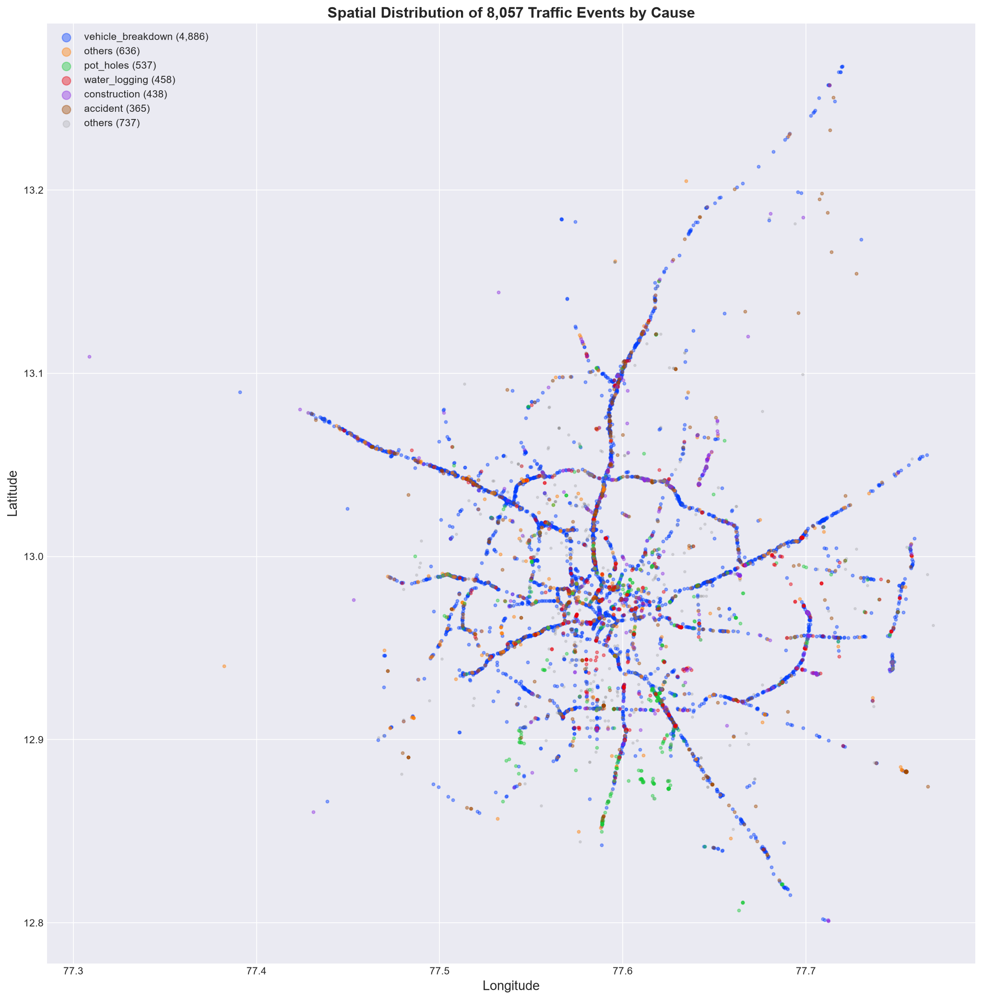
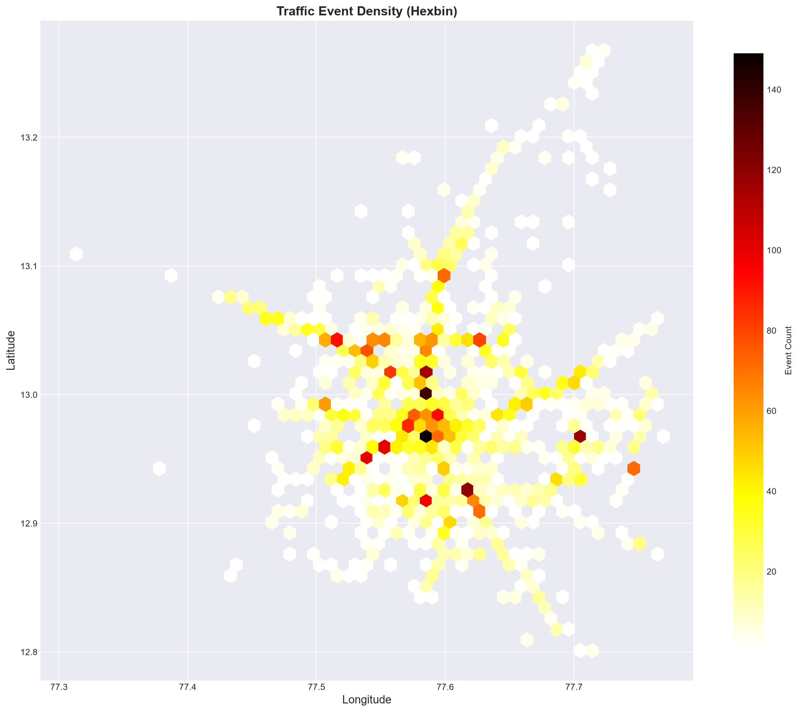
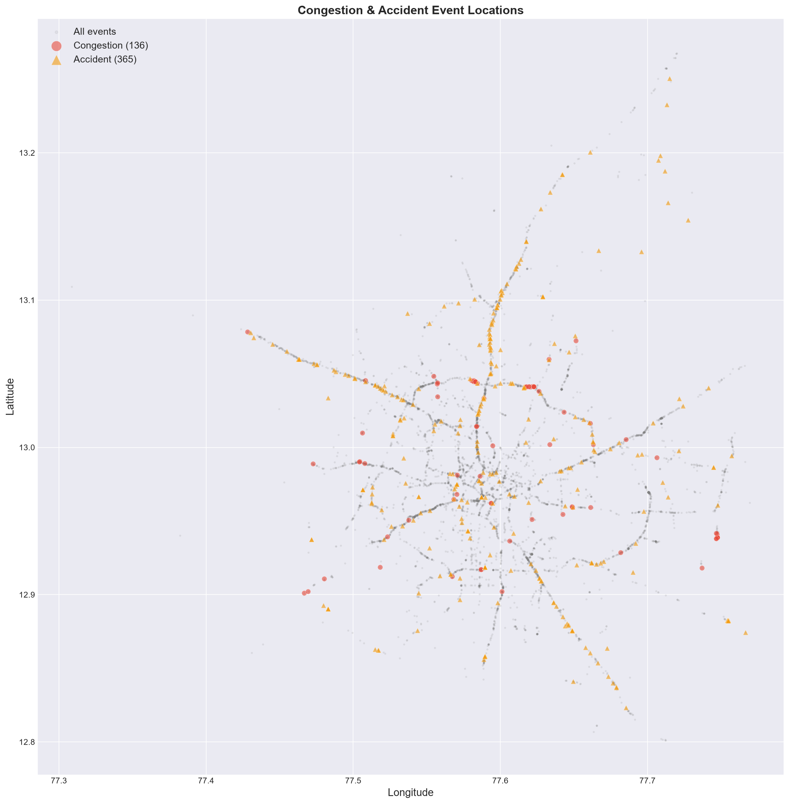

---

## 9. Text Analysis Insights

From 6,698 event descriptions (83.1% of records):
- **"problem"** (1,295 mentions) — generic incident reporting
- **"vehicle"** (947) — breakdown context
- **"slow movement"** (782+594) — direct congestion language
- **"bus"** (610) — BMTC reference
- **"bmtc"** (329) — explicit fleet breakdown
- **"breakdown"** (300) — direct cause
- **"flyover"** (263) — infrastructure-related
- **Kannada text present** (ಸರ್, ಜಂಕ್ಷನ್, ಟ್ರಾಫಿಕ್) — bilingual reporting

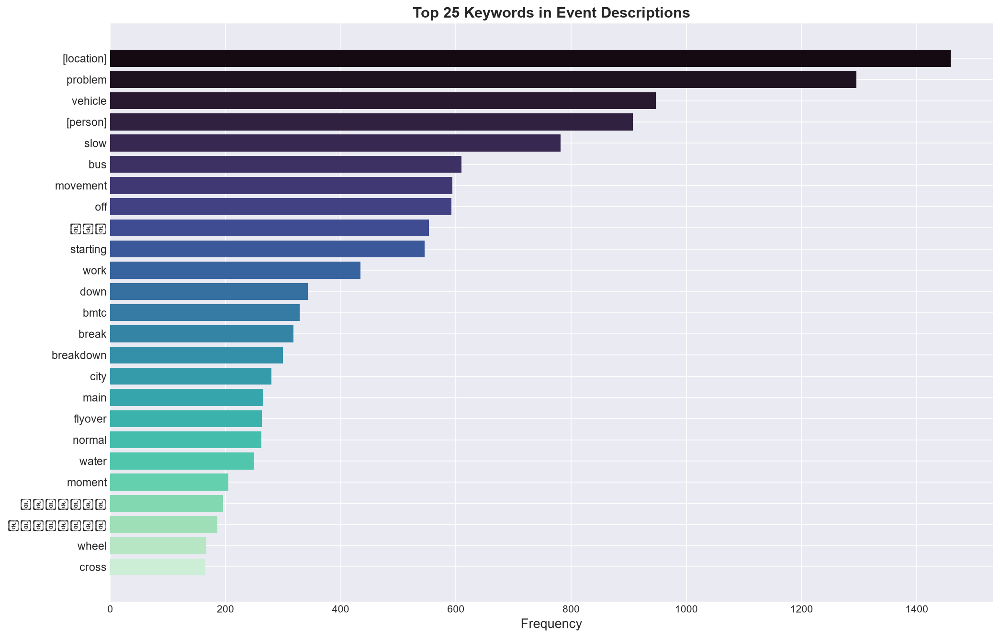

---

## 10. Status & Resolution

| Status | Count | % |
|---|---|---|
| **Closed** | 6,989 | 86.7% |
| Active | 999 | 12.4% |
| Resolved | 69 | 0.9% |

**86.7% closed** — much better lifecycle tracking than the violation data (which has 0% closed). The 12.4% still active may be chronic issues (potholes, road conditions).

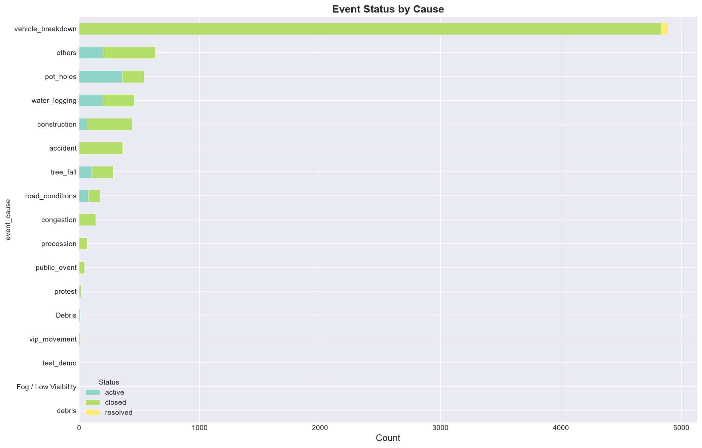

---

## Key Takeaways for the Project

### Finding 1: This Is Primarily a Vehicle Breakdown Log
60.6% breakdowns. Only 1.7% are explicitly labeled "congestion". It does NOT directly measure parking-induced congestion. We must **infer** the parking-congestion link through spatial correlation.

### Finding 2: BMTC Buses Are a Major Congestion Source
30% of breakdowns are BMTC buses. Large vehicles (buses + trucks + HVs) = 70% of breakdowns. Each blocks a full lane. This is a parallel insight worth presenting alongside the parking analysis.

### Finding 3: Two-Tier Duration Pattern
Acute (breakdowns/accidents): ~1 hour. Chronic (potholes/construction): 30-100+ hours. Impact weighting must account for this.

### Finding 4: Station Rankings Don't Overlap With Violations
Violation hotspots ≠ Event hotspots. Exception: HAL Old Airport. This means the parking-congestion link may be **indirect** or **mediated by road characteristics**.

### Finding 5: Road Closures (596 events) Are the Highest-Impact Subset
7.4% of events require road closure — these should be weighted highest in impact scoring.

### Finding 6: Temporal Lag Between Violations and Events
Violation peak: 05:00 UTC (10:30 AM IST). Event peak: 06:00 UTC (11:30 AM IST). One-hour lag is consistent with causality hypothesis.

---

## Next Steps
- [ ] Cross-dataset spatial analysis — overlay violation density with event density per grid cell
- [ ] Test correlation: "Do high-violation areas have more congestion events?"
- [ ] Calculate per-grid-cell impact scores
- [ ] Identify the HAL Old Airport zone as a case study
