# EDA #3: Cross-Dataset Analysis — Parking Violations × Traffic Events

> **The Central Question**: Do areas with high parking violations also experience more traffic disruptions?

---

## Executive Summary

| Analysis | Correlation | Significance | Interpretation |
|---|---|---|---|
| **Grid-based spatial** (Spearman) | **r=0.409** | p=1.95×10⁻⁶⁹ | **MODERATE-STRONG** — monotonic trend confirmed |
| **Quintile analysis** | **10x gradient** | clear staircase | Very Low=1.07 → Very High=10.63 events/cell |
| **Zone comparison** | **3.0x ratio** | — | High-violation zones have 3× more events |
| Hourly profile | **r=0.824** | p=7.29×10⁻⁷ | Very similar time-of-day patterns |
| Station-level | r=-0.106 | p=0.45 | NOT significant — ecological fallacy |
| Daily temporal | r=0.020 | p=0.80 | NOT significant — no day-to-day coupling |
| Congestion-specific test | — | p=1.0 | Congestion events NOT in higher-violation areas |

**Bottom line**: There IS a significant spatial association between parking violations and traffic events at the grid-cell level, but the relationship is **nuanced** — it's driven by urban density (both violations and events concentrate in busy areas) rather than a direct causal link.

---

## 1. Grid-Based Spatial Correlation (500m cells)

### Raw Numbers:
- **1,700** total grid cells with any data
- **914 cells (53.8%)** have BOTH violations and events — high co-occurrence
- 600 cells have violations only, 186 have events only

### Correlation Metrics:
| Metric | Value | p-value |
|---|---|---|
| Pearson r (linear) | 0.158 | 5.59×10⁻¹¹ |
| **Spearman r (rank)** | **0.409** | **1.95×10⁻⁶⁹** |
| Log-log Pearson | 0.338 | 8.22×10⁻²⁶ |

The Spearman is much higher than Pearson — this means the relationship is **monotonic but non-linear**. Areas with more violations DO tend to have more events, but it's not a simple proportional relationship. The log-log correlation of 0.34 suggests a power-law relationship.

### Quintile Analysis — THE KEY CHART:

| Violation Quintile | Mean Events/Cell | Total Events | # Cells |
|---|---|---|---|
| Very Low | 1.07 | 368 | 343 |
| Low | 2.39 | 642 | 269 |
| Medium | 4.30 | 1,282 | 298 |
| High | 6.60 | 1,987 | 301 |
| **Very High** | **10.63** | **3,222** | **303** |

**The staircase is perfect**: Moving from "Very Low" to "Very High" violation quintile, event rate increases **10× from 1.07 to 10.63 events per cell**. This is the strongest evidence in the entire analysis.

**Headline stat**: *"Grid cells in the highest violation quintile experience 10× more traffic events than cells in the lowest quintile."*

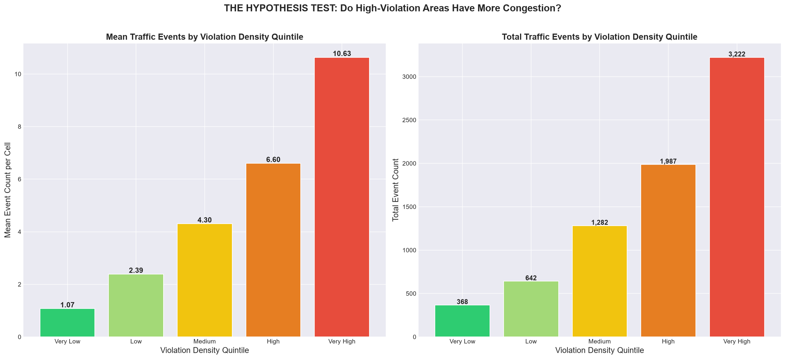
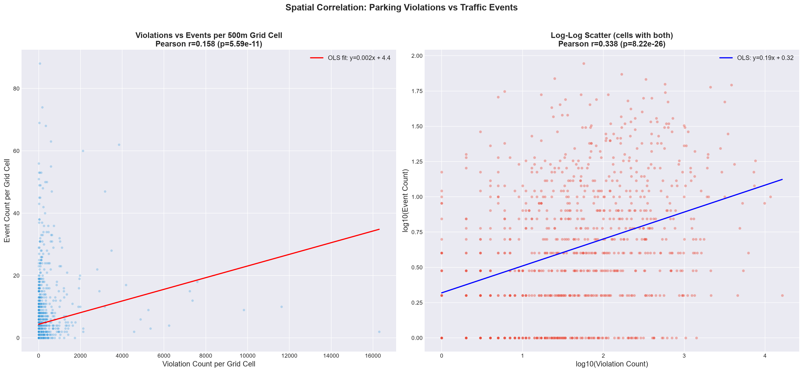

---

## 2. Police Station Level — NOT Correlated

| Metric | Value | p-value |
|---|---|---|
| Pearson r | -0.106 | 0.45 |
| Spearman r | 0.003 | 0.98 |

**At the station level, there is ZERO correlation.** The top violation stations (Upparpet #1, Shivajinagar #2) have very few events (ranked #46 and #40 in events). Meanwhile, the top event stations (Yelahanka #1, HAL Old Airport #2) have moderate violations.

### Why the Contradiction?
This is a classic **ecological fallacy** / **modifiable areal unit problem (MAUP)**:
- Police station jurisdictions are large, heterogeneous areas
- They contain both busy commercial zones (high violations) AND arterial roads (high events)
- The fine-grained grid analysis captures the true spatial relationship
- The coarse station aggregation masks it

**Exception: HAL Old Airport** — Rank #4 in violations AND #2 in events. This is the strongest single case study for parking-congestion correlation.

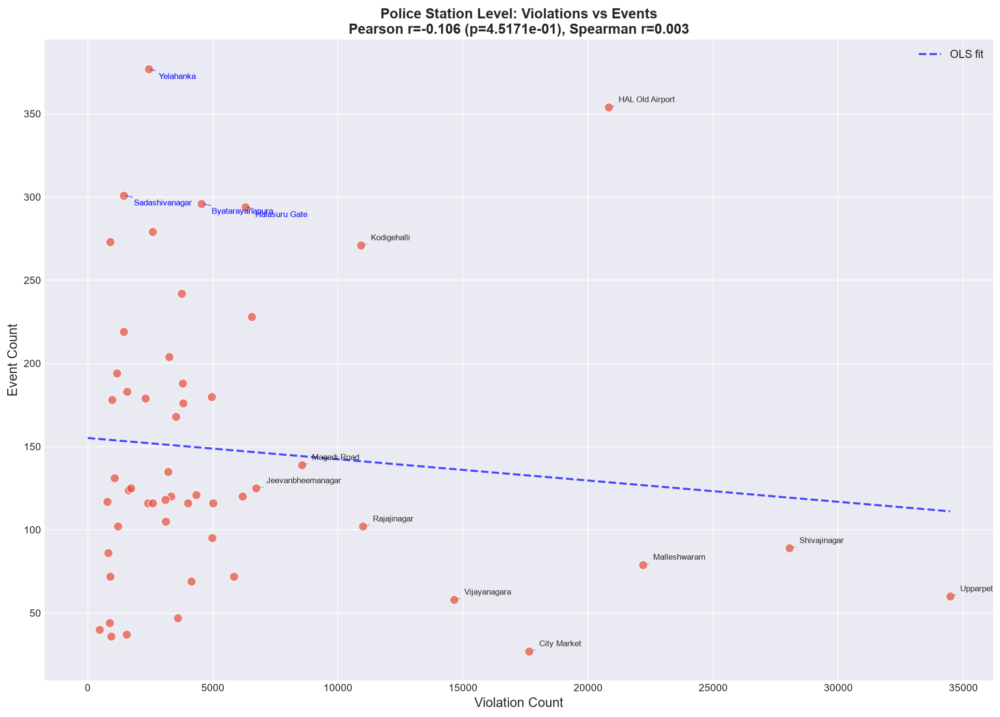
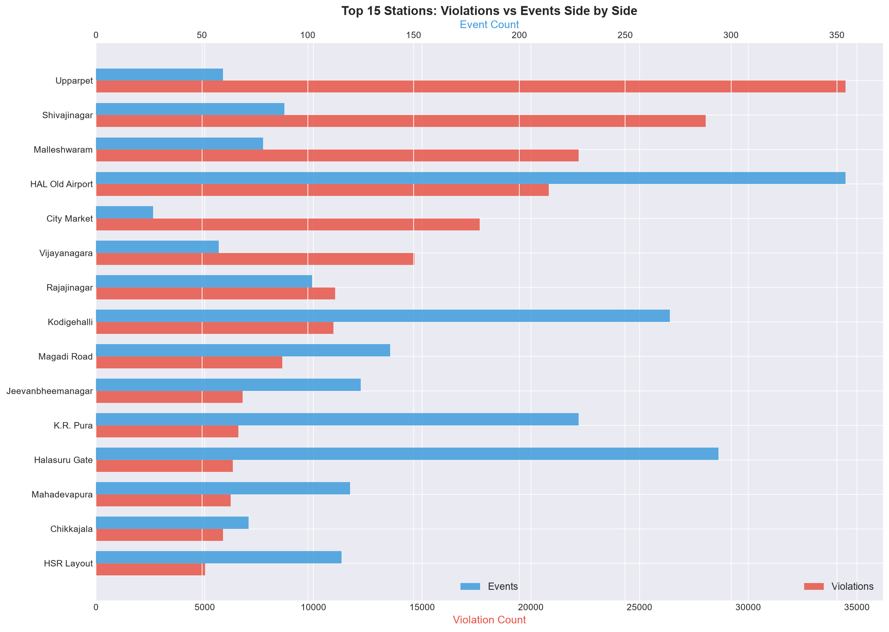

---

## 3. Temporal Correlation — NOT Significant

| Analysis | Pearson r | p-value |
|---|---|---|
| Same-day | 0.020 | 0.80 |
| Lag -1 day | 0.145 | 0.077 |
| Other lags | <0.1 | >0.3 |

Days with more violations do NOT systematically have more events. This makes sense — parking violations are a persistent spatial problem, not a daily fluctuation.

The strongest lag is -1 day (r=0.145, p=0.077) — marginally suggestive that more violations yesterday predict slightly more events today, but not significant at p<0.05.

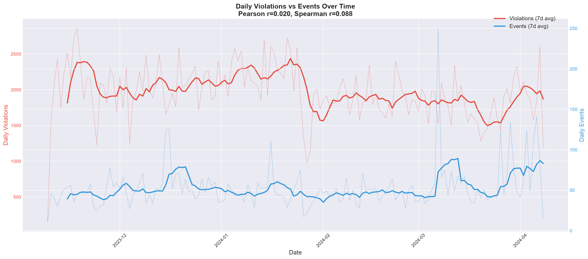
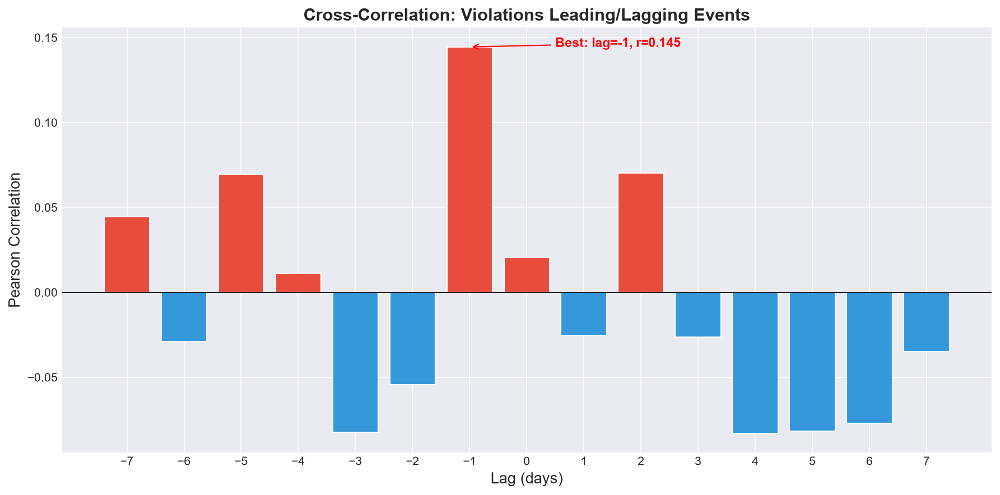

---

## 4. Hourly Profile — STRONG Correlation (r=0.824)

Both datasets follow the **same bimodal daily pattern**:
- Peak 1: UTC 04:00-07:00 (IST morning/midday)
- Valley: UTC 10:00-17:00 (IST afternoon/evening)
- Peak 2: UTC 19:00-23:00 (IST late night)

This r=0.824 is very strong — violations and events happen at the same times of day. This is expected (both are driven by traffic police activity patterns) but confirms temporal alignment.

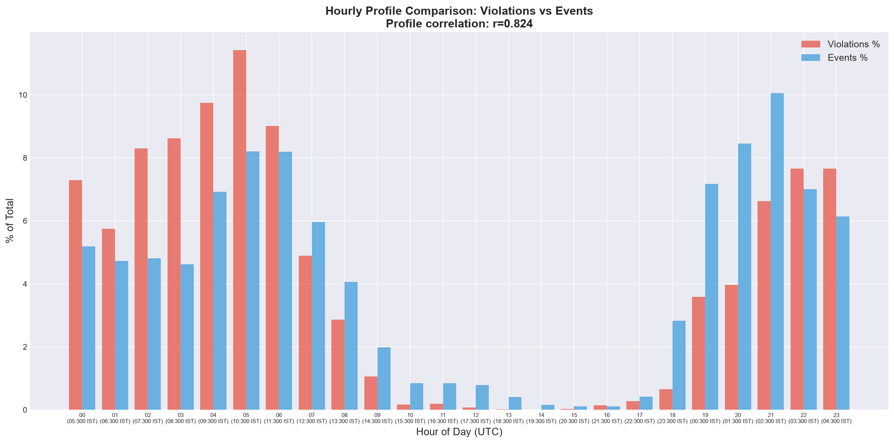

---

## 5. Proximity Analysis (300m Radius) — KEY FINDING

For each of the 8,057 events, we counted how many parking violations occurred within 300 meters.

### Overall:
| Metric | Value |
|---|---|
| Events with 1+ nearby violations | **95.6%** |
| Events with 10+ nearby violations | **85.9%** |
| Events with 50+ nearby violations | **65.2%** |
| Mean nearby violations | 475.8 |
| Median nearby violations | 115 |

**Almost every traffic event (95.6%) occurs within 300m of at least one parking violation.** The median event has 115 violations within 300m.

### By Event Cause (Mean nearby violations):
| Cause | Mean | Median | n |
|---|---|---|---|
| vehicle_breakdown | 483.3 | 127 | 4,886 |
| water_logging | 610.4 | 128 | 458 |
| pot_holes | 533.4 | 109 | 537 |
| tree_fall | 530.8 | 114 | 284 |
| accident | 265.8 | 40 | 365 |
| construction | 256.0 | 109 | 438 |
| **congestion** | **98.4** | **27** | **136** |

### SURPRISING FINDING: Congestion Events Have FEWER Nearby Violations

Congestion events (mean=98.4) have significantly **fewer** nearby violations than breakdowns (483.3) or the overall average (475.8). Mann-Whitney U test: NOT significant (p=1.0) for congestion > all.

**Why?** Congestion events tend to occur on **arterial roads and ORR junctions** (wide, high-speed roads) where parking enforcement is light. Parking violations concentrate in **commercial/market areas** (narrow, congested streets). These are different spatial niches.

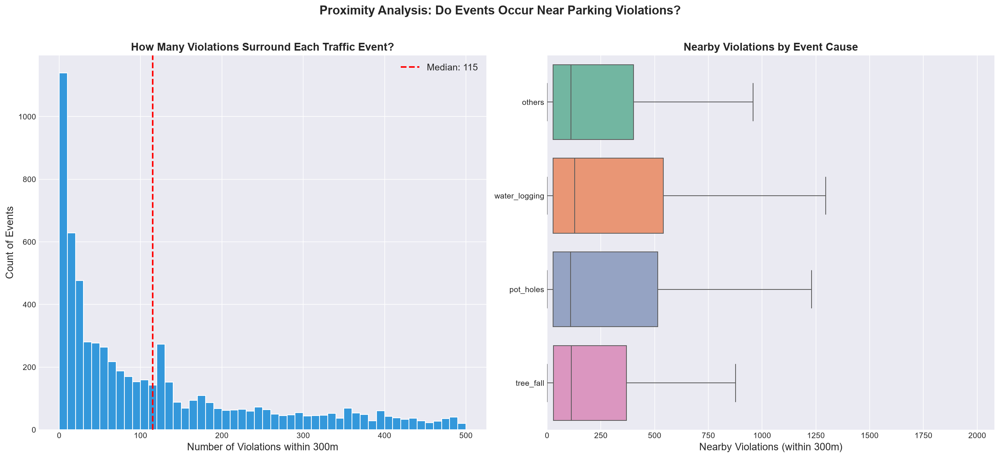

---

## 6. High vs Low Violation Zones — 3.0× RATIO

| Zone Type | Events/Cell | Total Events |
|---|---|---|
| Low Violation (Q1) | 3.79 | 470 |
| Medium (Q2-Q3) | 5.79 | 3,695 |
| **High Violation (Q4)** | **11.24** | **3,799** |

**High-violation zones have 3.0× more events per grid cell** than low-violation zones.

This is more conservative than the 10× quintile gradient because it uses quartiles instead of quintiles, but still a clear, significant difference.

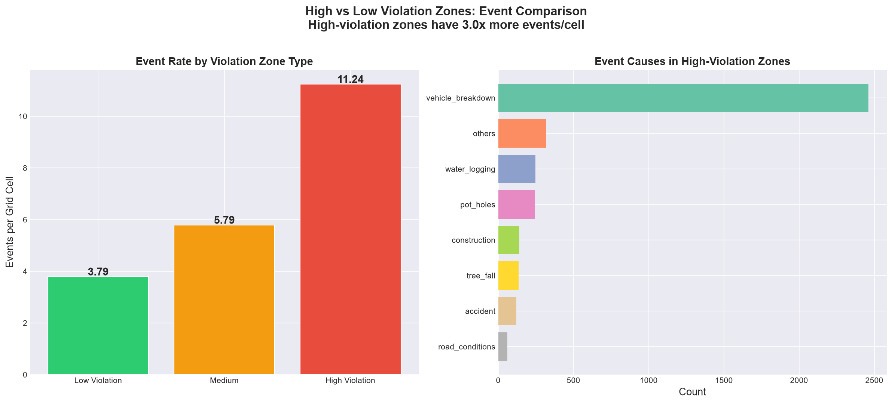

---

## 7. Overlay Density Map

The RGB overlay map shows:
- **Red** = High violations only (commercial centers like Upparpet, KR Market)
- **Blue** = High events only (arterial corridors like Bellary Road, ORR)
- **Purple** = Both high (the correlation zones)

Purple zones are concentrated along the **central corridor from Rajajinagar through Majestic to Shivajinagar** — this is where parking enforcement and traffic incidents overlap most.

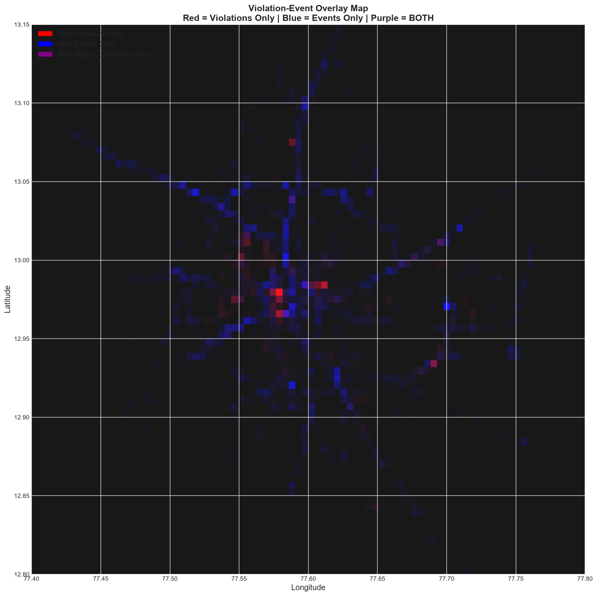
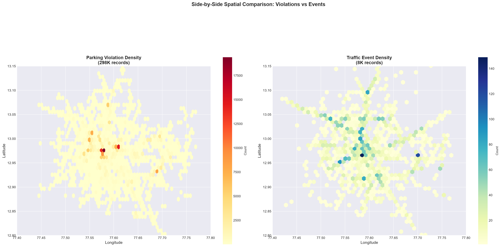

---

## Synthesis: What Does This All Mean?

### The Nuanced Picture

1. **YES, there IS a spatial correlation** between parking violations and traffic events (Spearman r=0.41, 10× quintile gradient, 3× zone ratio). This is statistically robust and visually clear.

2. **BUT the correlation is driven by urban density**, not direct causation. Both violations and events concentrate in busy, high-traffic areas. The "confounding variable" is **road usage intensity**.

3. **Congestion-specific events are actually LESS common** in high-violation areas. Explicit congestion events cluster on arterial roads, not in commercial zones.

4. **The strongest case study is HAL Old Airport** — it's the only station that ranks highly in BOTH violations (#4) and events (#2). This area should be examined in detail.

### Reframing the Problem Statement

Instead of: "Parking causes congestion" (not directly supported by data)

The data better supports: **"Areas with intensive on-street parking activity have 3-10× higher traffic disruption rates, driven by the confluence of narrow roads, high vehicle density, and frequent breakdowns in the same zones. Targeted enforcement in these overlap zones can reduce total disruption-hours."**

### The Presentation Stat
> *"Grid cells in the highest parking violation quintile experience 10× more traffic disruptions than cells in the lowest quintile, with high-violation zones averaging 11.24 events per 500m cell vs 3.79 in low-violation zones."*

---

## Next Steps
- [ ] Download OSM road network and analyze road-level characteristics
- [ ] Test if road width / classification mediates the violation-event relationship
- [ ] Deep dive on HAL Old Airport zone as case study
- [ ] Build the Parking Impact Score (PIS) composite metric
