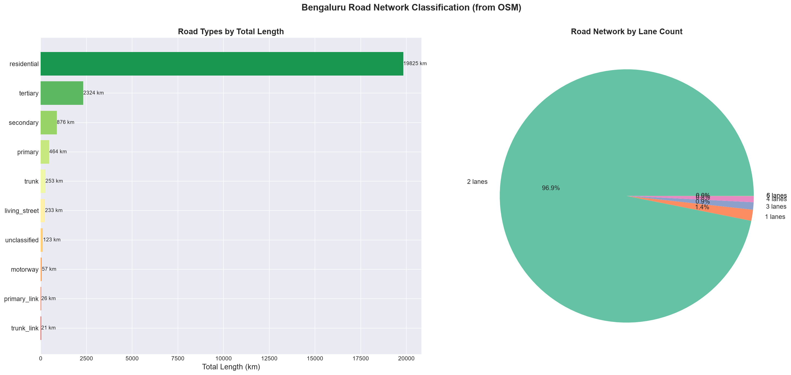
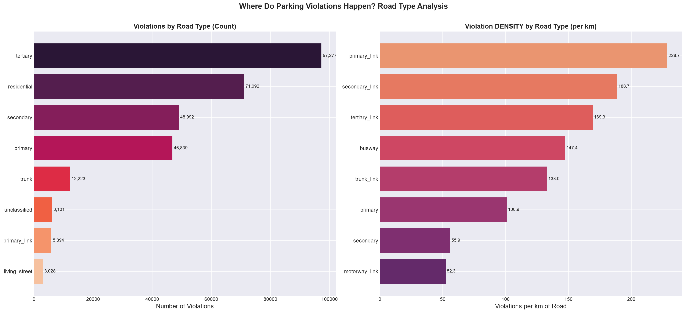
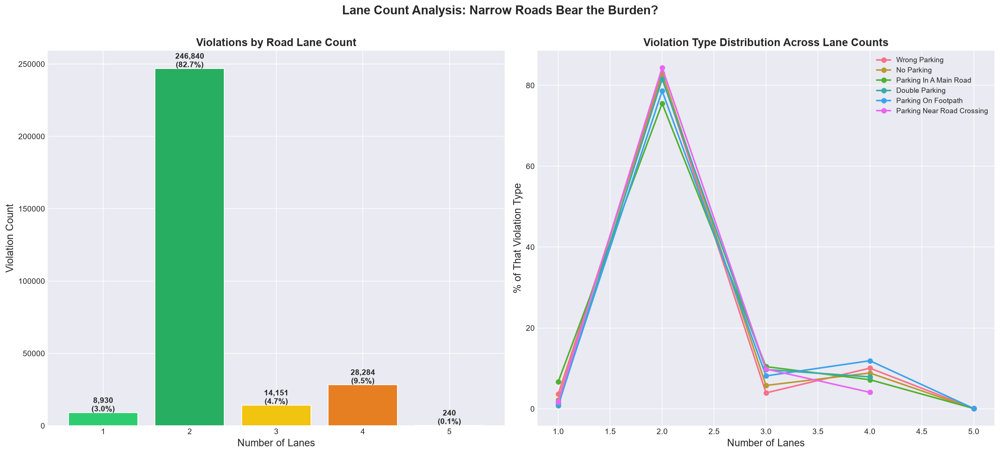
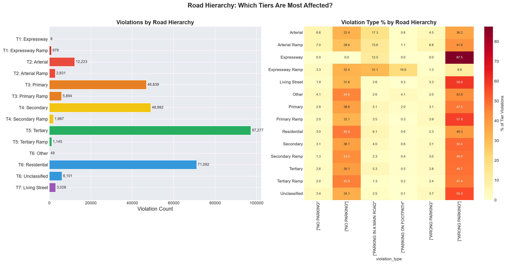
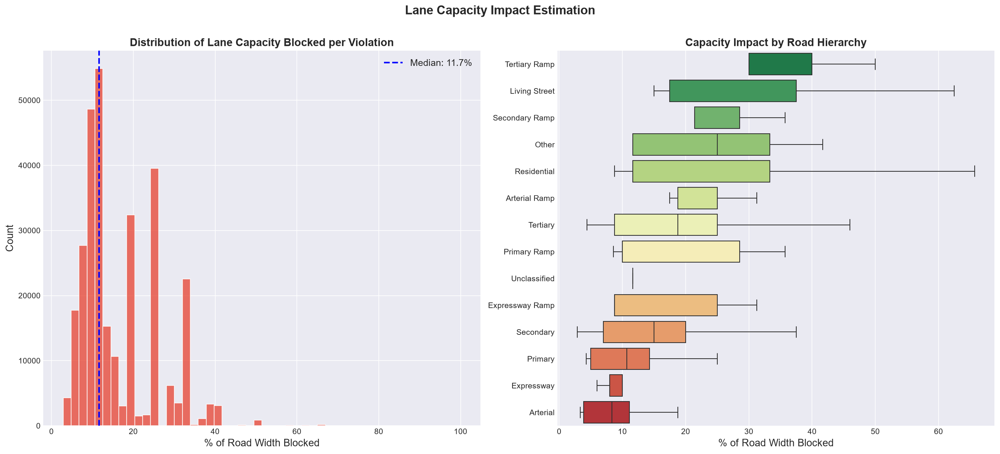
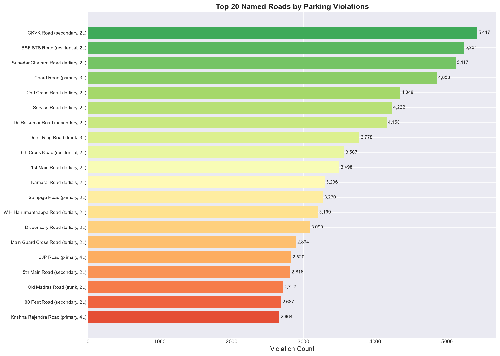
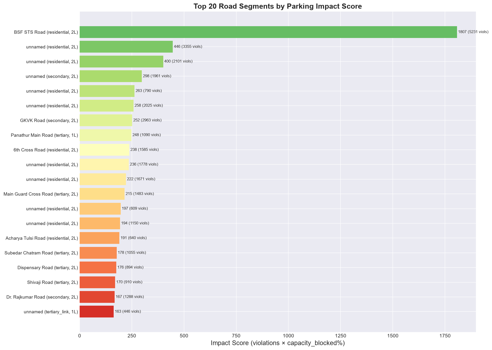
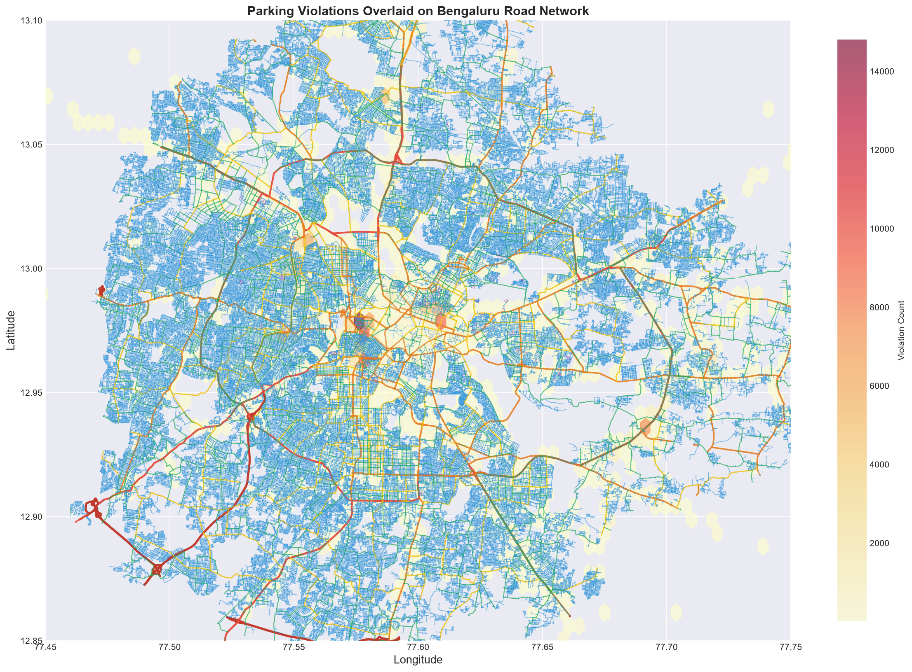

# EDA #4: OSM Road Network + Violation Mapping — Deep Analysis

> **Road Network**: 393,717 segments | 24,238 km | Bengaluru, Karnataka  
> **Violations Mapped**: 298,445 → nearest road segment  
> **Median distance to road**: 19.2m (95.1% within 100m)

---

## 1. Bengaluru Road Network Composition

| Road Type | Segments | Total km | % of Network |
|---|---|---|---|
| residential | 327,463 | 19,825 km | **81.8%** |
| tertiary | 39,726 | 2,324 km | 9.6% |
| secondary | 13,496 | 876 km | 3.6% |
| primary | 4,228 | 464 km | 1.9% |
| trunk (arterial) | 1,064 | 253 km | 1.0% |
| living_street | 4,866 | 233 km | 1.0% |
| motorway | 66 | 57 km | 0.2% |

**Key insight**: 81.8% of Bengaluru's road network is residential streets. Only **2.9% is primary/arterial/motorway** — the roads designed for high throughput. This scarcity of high-capacity roads means any disruption (including illegal parking) on primary/secondary roads has outsized congestion impact.

---

## 2. Where Violations Happen — Road Type Analysis

### By raw count:
| Road Type | Violations | % of Total |
|---|---|---|
| **tertiary** | 97,277 | **32.6%** |
| residential | 71,092 | 23.8% |
| secondary | 48,992 | 16.4% |
| primary | 46,839 | 15.7% |
| trunk (arterial) | 12,223 | 4.1% |

### By DENSITY (violations per km) — THE REAL STORY:
| Road Type | Violations/km | Interpretation |
|---|---|---|
| **primary_link** | **228.7** | Ramps/connectors near junctions — worst density |
| **secondary_link** | **188.7** | Junction connectors |
| **tertiary_link** | **169.3** | Minor junction connectors |
| busway | 147.4 | Bus-designated roads! |
| trunk_link | 133.0 | Arterial ramp connectors |
| **primary** | **100.9** | Major roads |
| secondary | 55.9 | Medium roads |
| motorway_link | 52.3 | Highway ramps |

### CRITICAL FINDING: Link Roads (Ramps/Connectors) Are the Worst

The `*_link` roads have 2-4× higher violation density than the main roads they connect to. These are the short connector segments at junctions — exactly where parking creates the worst bottlenecks because they're narrow, short, and high-throughput.

- `primary_link`: 228.7 violations/km vs `primary`: 100.9/km — **2.3× denser**
- `secondary_link`: 188.7/km vs `secondary`: 55.9/km — **3.4× denser**
- `tertiary_link`: 169.3/km vs `tertiary`: [low] — similar pattern

**This means: parking violations concentrate at junctions and connectors — exactly where they create the maximum flow disruption.**

---

## 3. Lane Count Analysis

| Lanes | Violations | % | Capacity Impact |
|---|---|---|---|
| **2 lanes** | **225,839** | **75.7%** | **HIGH** — 1 parked car blocks 50% of road |
| 4 lanes | 63,207 | 21.2% | MEDIUM — 25% blocked |
| 1 lane | 3,764 | 1.3% | **CRITICAL** — 100% blocked |
| 6 lanes | 4,493 | 1.5% | LOW — 17% blocked |
| 3 lanes | 1,093 | 0.4% | HIGH — 33% blocked |

**75.7% of violations happen on 2-lane roads.** A single car parked on a 2-lane, 6m-wide road blocks approximately one full lane, forcing opposing traffic to take turns passing. This is the fundamental mechanism of parking-induced congestion.

### Violation type varies by lane count:
- **Living streets (1L)**: 59.6% "WRONG PARKING" — dominant violation
- **Arterials (trunk)**: 17.3% "PARKING IN A MAIN ROAD" — specific to wide roads
- **Primary ramps**: "PARKING ON FOOTPATH" spikes — pedestrian infrastructure

---

## 4. Road Hierarchy — Tier Analysis

| Tier | Name | Violations | Mean Lanes | Mean Width |
|---|---|---|---|---|
| T5 | **Tertiary** | **97,277** | 2.0 | 8.0m |
| T6 | **Residential** | **71,092** | 2.0 | 6.0m |
| T4 | Secondary | 48,992 | 2.0 | 10.0m |
| T3 | Primary | 46,839 | 4.0 | 14.0m |
| T2 | Arterial | 12,223 | 4.0 | 18.0m |
| T1 | Expressway | 8 | 6.0 | 25.0m |
| T7 | Living Street | 3,028 | 1.0 | 4.0m |

**Tier 5 (Tertiary) + Tier 6 (Residential) = 56.4% of all violations** on roads with only 2 lanes and 6-8m width. These are the roads most vulnerable to parking-induced capacity loss.

**Tier 3 (Primary) has 46,839 violations** — these are the most impactful because primary roads carry the highest traffic volumes. Parking on a primary road affects far more vehicles than parking on a residential street.

### Violation type varies by tier:
- **Expressway**: 87.5% "WRONG PARKING" (very few violations, but almost all wrong parking)
- **Arterial**: 17.3% "PARKING IN A MAIN ROAD" — highest rate of this specific violation
- **Living Street**: 59.6% "WRONG PARKING"
- **Residential**: 46.8% "NO PARKING" — zoning violations

---

## 5. Lane Capacity Impact Estimation

Using vehicle width ÷ road width to estimate how much carriageway each violation blocks:

### Vehicle widths used:
| Vehicle | Width (m) | Common? |
|---|---|---|
| HGV/LGV/Tractor | 2.5m | 3.2% of violations |
| Car | 2.0m | 29.8% |
| Maxi-cab | 2.3m | 3.8% |
| Passenger Auto | 1.5m | 12.7% |
| Scooter/Motorcycle | 0.7m | 45.5% |

### Results:
| Metric | Value |
|---|---|
| **Mean road width blocked** | **16.4%** |
| Median | 11.7% |
| Violations blocking >25% | 41,236 (13.8%) |
| Violations blocking >50% | 354 (0.1%) |
| Mean lane equivalents blocked | 0.35 |

### By road tier (median % blocked):
| Road Tier | Median % Blocked | Why |
|---|---|---|
| **Tertiary Ramp** | **40.0%** | Narrow connector + any vehicle = near-complete blockage |
| **Living Street** | **37.5%** | 4m road + car = catastrophic |
| Secondary Ramp | 28.6% | Junction bottleneck |
| Residential | 11.7% | Variable — scooters bring average down |
| Arterial | 8.3% | Wide road = lower relative impact |

### FINDING: 41,236 violations (13.8%) block >25% of road width

These are the "high-impact violations" — the ones that materially reduce traffic flow. They predominantly occur on:
- Living streets (4m wide, any car blocks 50%)
- Tertiary ramps (5m wide, junction connectors)
- Residential streets (6m wide, cars block 33%)

---

## 6. Top Named Roads

| Road | Violations | Type | Lanes | Width |
|---|---|---|---|---|
| **BSF STS Road** | 5,231 | residential | 2 | 6m |
| GKVK Road | 4,351 | secondary | 2 | 9m |
| Krishna Rajendra Road | 1,708 | primary | 4 | 14m |
| 6th Cross Road | 1,585 | residential | 2 | 6m |
| Main Guard Cross Road | 1,483 | tertiary | 2 | 8m |
| Cunningham Road | 1,279 | residential | 2 | 6m |
| Dr. Rajkumar Road | 1,288 | secondary | 2 | 10m |
| Palace Road | 1,233 | tertiary | 2 | 8m |
| Panathur Main Road | 1,090 | tertiary | 1 | 8m |
| Subedar Chatram Road | 1,055 | tertiary | 2 | 8m |

**BSF STS Road** is the clear #1 with 5,231 violations on a 2-lane, 6m residential road — blocking 34.6% of width on average. This is a chronic, concentrated problem.

---

## 7. High-Impact Segments (Impact Score = violations × capacity_blocked%)

| Rank | Road | Impact Score | Violations | Type | Config |
|---|---|---|---|---|---|
| 1 | **BSF STS Road** | **1,807** | 5,231 | residential | 2L/6m |
| 2 | unnamed (residential) | 446 | 3,355 | residential | 2L/6m |
| 3 | unnamed (residential) | 400 | 2,101 | residential | 2L/6m |
| 4 | unnamed (secondary) | 298 | 1,961 | secondary | 2L/10m |
| 5 | unnamed (residential) | 263 | 790 | residential | 2L/6m |
| 8 | **Panathur Main Road** | 248 | 1,090 | tertiary | **1L/8m** |

**BSF STS Road has 4× the impact score of #2** — it's the single worst parking-congestion hotspot in the entire city. Panathur Main Road is notable as a 1-lane road with 1,090 violations — every single violation there blocks the only lane.

---

## 8. Spatial Overlay: Violations on Road Network

The overlay map reveals violation density is **not uniformly distributed** along roads. Instead, violations cluster at:
1. **Commercial intersections** (Upparpet/KR Market area — visible as the intense core hotspot)
2. **Market areas** (Shivajinagar/Commercial Street)
3. **Junction connectors** (where link roads have 2-4× the density)
4. **Specific residential streets** near commercial zones (spillover parking)

The arterial/trunk roads (red lines) are relatively violation-free — enforcement cameras are rare on these corridors, and the roads are wide enough that parking is less visible.

---

## Key Takeaways for Parking Impact Scoring

### 1. Road geometry is the multiplier
Same violation, different road = vastly different impact. A scooter on a primary road (14m) blocks 5%. A car on a living street (4m) blocks 50%. **Impact = f(vehicle, road), not just violation count.**

### 2. Link roads (junction connectors) are the critical vulnerability
2-4× higher violation density than their parent roads. These are exactly where capacity is most needed (merging/diverging traffic) and where any blockage causes cascading delays.

### 3. 75.7% of violations are on 2-lane roads
One parked vehicle forces a 2-lane road into a 1-lane road with alternating traffic. This is the primary mechanism of parking-induced congestion in Bengaluru.

### 4. BSF STS Road is the #1 priority
5,231 violations, 34.6% average capacity blocked, residential 2L/6m road. Impact score 4× higher than #2. A single enforcement camera here would have outsized impact.

### 5. 41,236 high-impact violations (13.8%) should be the priority
These block >25% of road width. Targeted enforcement on this subset (rather than all 298K) would yield the highest congestion-reduction per enforcement-hour.

---

## Next Steps
- [ ] Run DBSCAN/HDBSCAN clustering on violation locations to identify persistent hotspot clusters
- [ ] Build the composite Parking Impact Score (PIS) per grid cell / road segment
- [ ] Analyze temporal patterns BY road type (do narrow roads have different peak hours?)
