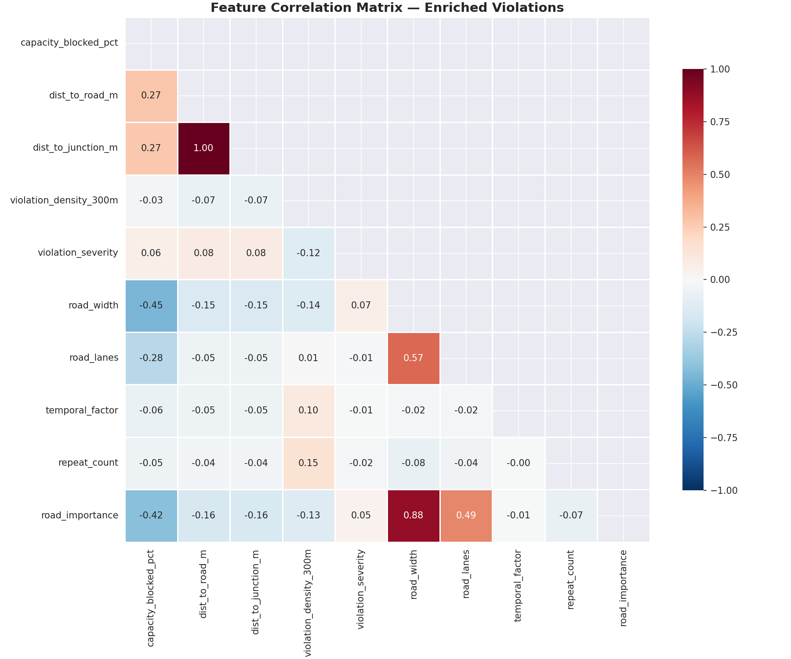
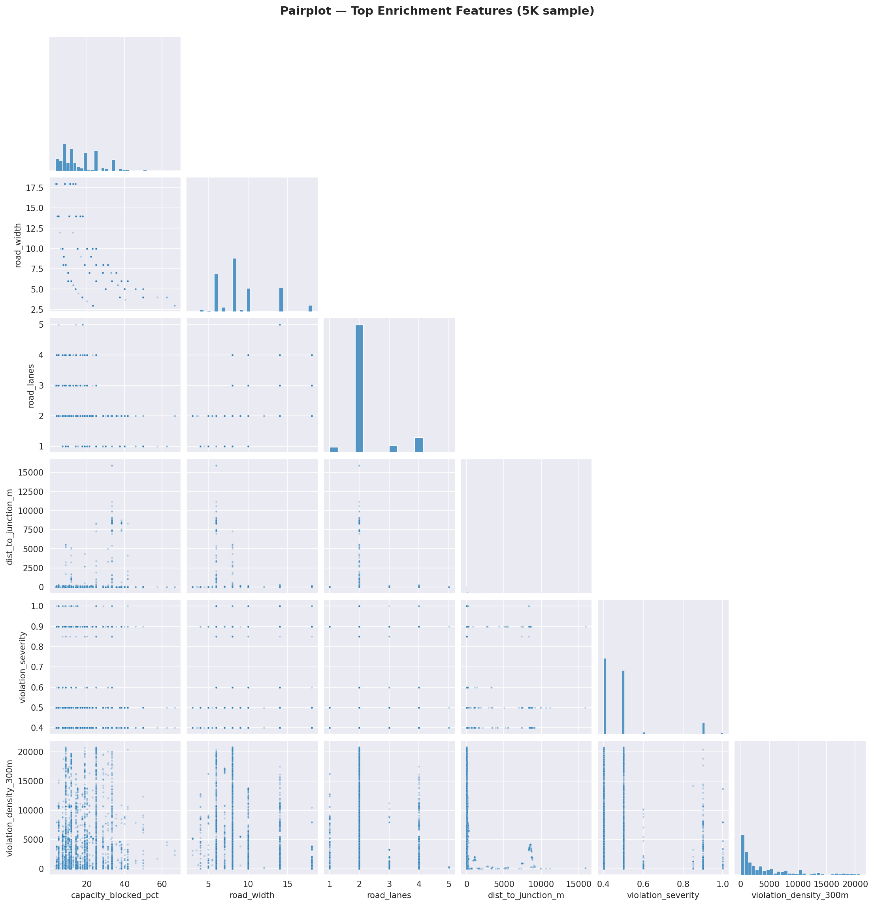
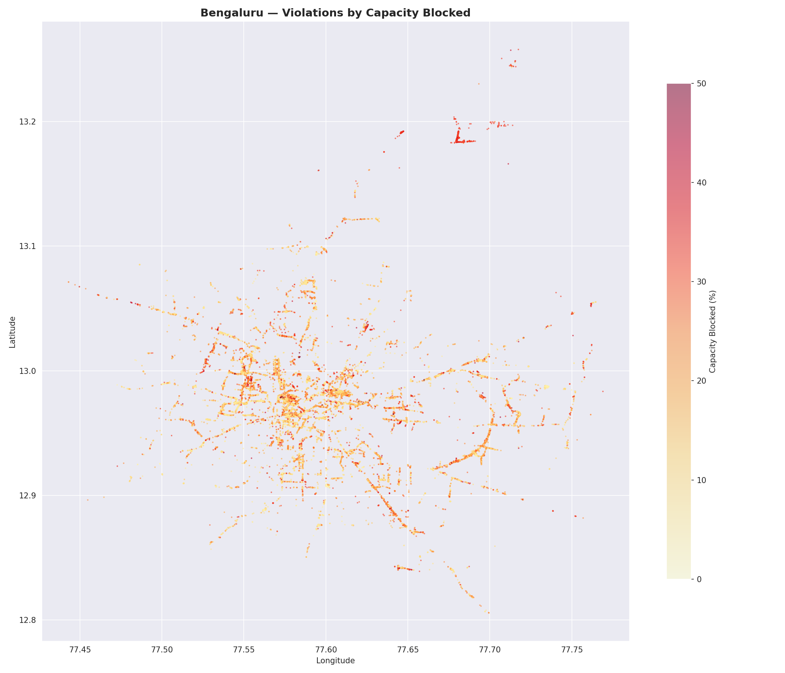
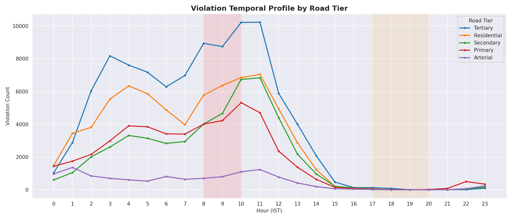
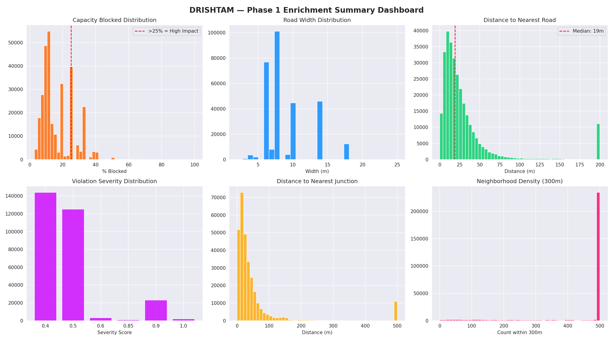
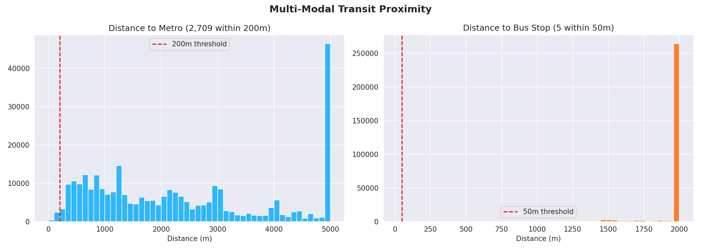

# Phase 1 — Enriched Data Summary

> Auto-generated by `scripts/01_build_enriched_data.py`

## Dataset Overview

- **Records**: 298,445
- **Features**: 77
- **Memory**: 618.3 MB

## Feature Statistics

```
======================================================================
DRISHTAM — Enriched Data Summary
======================================================================
Shape: 298,445 rows x 77 columns
Memory: 618.3 MB

--- Key Feature Statistics ---
                               mean          std       min          50%           max
capacity_blocked_pct      16.401236     9.508063  2.871206    11.666667    100.000000
dist_to_road_m           237.533172  1286.116173  0.017504    19.188546  18357.551300
dist_to_junction_m       246.933244  1282.648187  0.056541    24.557411  18345.819487
violation_density_300m  4202.389747  5018.701986  0.000000  1991.000000  20851.000000
violation_severity         0.488348     0.138853  0.400000     0.500000      1.000000
road_width                 9.031442     3.249054  2.000000     8.000000     25.000000
road_lanes                 2.209449     0.647914  1.000000     2.000000      5.000000
temporal_factor            0.533879     0.290172  0.140000     0.560000      1.000000
repeat_count               2.182328     3.121964  1.000000     1.000000     55.000000

--- Road Tier Distribution ---
  Tertiary            :   97,277 (32.6%)
  Residential         :   71,092 (23.8%)
  Secondary           :   48,992 (16.4%)
  Primary             :   46,839 (15.7%)
  Arterial            :   12,223 (4.1%)
  Unclassified        :    6,101 (2.0%)
  Primary Ramp        :    5,894 (2.0%)
  Living Street       :    3,028 (1.0%)
  Arterial Ramp       :    2,831 (0.9%)
  Secondary Ramp      :    1,987 (0.7%)
  Tertiary Ramp       :    1,145 (0.4%)
  Expressway Ramp     :      979 (0.3%)
  Other               :       49 (0.0%)
  Expressway          :        8 (0.0%)

--- Impact Stats ---
  High-impact (>25% blocked): 41,236 (13.8%)
  Mean capacity blocked: 16.4%
  Near metro (<200m): 2,709 (0.9%)
  Near bus stop (<50m): 5 (0.0%)
```

## Column List

| # | Column | Dtype | Nulls |
|---|---|---|---|
| 1 | `id` | object | 0 |
| 2 | `latitude` | float64 | 0 |
| 3 | `longitude` | float64 | 0 |
| 4 | `location` | object | 3,036 |
| 5 | `vehicle_number` | object | 0 |
| 6 | `vehicle_type` | object | 0 |
| 7 | `description` | float64 | 298,445 |
| 8 | `violation_type` | object | 0 |
| 9 | `offence_code` | object | 0 |
| 10 | `created_datetime` | datetime64[ns, UTC] | 0 |
| 11 | `closed_datetime` | float64 | 298,445 |
| 12 | `modified_datetime` | object | 0 |
| 13 | `device_id` | object | 0 |
| 14 | `created_by_id` | object | 0 |
| 15 | `center_code` | float64 | 11,255 |
| 16 | `police_station` | object | 0 |
| 17 | `data_sent_to_scita` | bool | 0 |
| 18 | `junction_name` | object | 0 |
| 19 | `action_taken_timestamp` | float64 | 298,445 |
| 20 | `data_sent_to_scita_timestamp` | object | 256,284 |
| 21 | `updated_vehicle_number` | object | 125,249 |
| 22 | `updated_vehicle_type` | object | 125,249 |
| 23 | `validation_status` | object | 125,249 |
| 24 | `validation_timestamp` | object | 125,249 |
| 25 | `violation_type_raw` | object | 0 |
| 26 | `violation_types_list` | object | 0 |
| 27 | `primary_violation` | object | 0 |
| 28 | `violation_count` | int64 | 0 |
| 29 | `is_congestion_relevant` | bool | 0 |
| 30 | `violation_severity` | float64 | 0 |
| 31 | `vehicle_type_clean` | object | 0 |
| 32 | `vehicle_width_m` | float64 | 0 |
| 33 | `created_datetime_ist` | datetime64[ns, UTC] | 0 |
| 34 | `hour_ist` | int32 | 0 |
| 35 | `day_of_week` | int32 | 0 |
| 36 | `month` | int32 | 0 |
| 37 | `is_weekend` | bool | 0 |
| 38 | `is_peak_morning` | bool | 0 |
| 39 | `is_peak_evening` | bool | 0 |
| 40 | `hour_sin` | float64 | 0 |
| 41 | `hour_cos` | float64 | 0 |
| 42 | `dow_sin` | float64 | 0 |
| 43 | `dow_cos` | float64 | 0 |
| 44 | `temporal_factor` | float64 | 0 |
| 45 | `peak_period` | object | 0 |
| 46 | `enforcement_active` | float64 | 0 |
| 47 | `is_approved` | bool | 0 |
| 48 | `repeat_count` | int64 | 0 |
| 49 | `repeat_score` | float64 | 0 |
| 50 | `is_chronic_offender` | bool | 0 |
| 51 | `nearest_edge_idx` | int64 | 0 |
| 52 | `dist_to_road_m` | float64 | 0 |
| 53 | `highway_clean` | object | 0 |
| 54 | `road_tier` | int64 | 0 |
| 55 | `road_tier_name` | object | 0 |
| 56 | `road_lanes` | int64 | 0 |
| 57 | `road_width` | float64 | 0 |
| 58 | `road_importance` | float64 | 0 |
| 59 | `road_name` | object | 0 |
| 60 | `is_link_road` | bool | 0 |
| 61 | `road_length_m` | float64 | 0 |
| 62 | `segment_degree` | int64 | 0 |
| 63 | `road_mid_lat` | float64 | 0 |
| 64 | `road_mid_lon` | float64 | 0 |
| 65 | `capacity_blocked_pct` | float64 | 0 |
| 66 | `lanes_blocked` | float64 | 0 |
| 67 | `dist_to_junction_m` | float64 | 0 |
| 68 | `junction_degree` | int64 | 0 |
| 69 | `is_near_major_junction` | bool | 0 |
| 70 | `violation_density_300m` | int32 | 0 |
| 71 | `violation_density_500m` | int32 | 0 |
| 72 | `dist_to_metro_m` | float64 | 0 |
| 73 | `is_near_metro` | bool | 0 |
| 74 | `dist_to_bus_stop_m` | float64 | 0 |
| 75 | `is_near_bus_stop` | bool | 0 |
| 76 | `road_type_simple` | object | 0 |
| 77 | `is_high_impact` | bool | 0 |

## Key Distributions

### Capacity Blocked
- Mean: 16.4%
- Median: 11.7%
- >25% (high-impact): 41,236

### Road Tier Breakdown

| Tier | Count | % |
|---|---|---|
| Tertiary | 97,277 | 32.6% |
| Residential | 71,092 | 23.8% |
| Secondary | 48,992 | 16.4% |
| Primary | 46,839 | 15.7% |
| Arterial | 12,223 | 4.1% |
| Unclassified | 6,101 | 2.0% |
| Primary Ramp | 5,894 | 2.0% |
| Living Street | 3,028 | 1.0% |
| Arterial Ramp | 2,831 | 0.9% |
| Secondary Ramp | 1,987 | 0.7% |
| Tertiary Ramp | 1,145 | 0.4% |
| Expressway Ramp | 979 | 0.3% |
| Other | 49 | 0.0% |
| Expressway | 8 | 0.0% |

## Visualizations






