# Phase 2 — Parking Impact Score (PIS) Report

> Auto-generated by `scripts/02_compute_impact_scores.py`

## PIS Summary

- **Records scored**: 298,445
- **Mean PIS**: 40.6
- **Median PIS**: 40.5
- **Std PIS**: 6.9
- **Min PIS**: 13.4
- **Max PIS**: 68.9

## PIS Band Distribution

| Band | Count | % |
|---|---|---|
| LOW | 220 | 0.1% |
| MODERATE | 140,984 | 47.2% |
| HIGH | 156,462 | 52.4% |
| SEVERE | 779 | 0.3% |
| CRITICAL | 0 | 0.0% |

## Economic Impact

- **Total hourly cost**: ₹2,340,761,070
- **Estimated daily cost**: ₹18,726,088,558 (~₹1872.6 crore)
- **Estimated annual cost**: ₹4,681,522,139,593 (~₹468152 crore)

## Carbon Impact

- **CO₂ per hour (all violations)**: 14,713,355 kg
- **Annual estimate**: 29,426,711 tonnes CO₂
- **Equivalent trees needed**: 1,337,577,754

## Data-Driven Weights (Random Forest)

| Component | Expert Weight | Learned Weight |
|---|---|---|
| capacity | 0.300 | 0.126 |
| importance | 0.200 | 0.208 |
| junction | 0.150 | 0.153 |
| temporal | 0.150 | 0.161 |
| density | 0.100 | 0.226 |
| severity | 0.100 | 0.126 |

## Top 10 Enforcement Zones

| Rank | Violations | Mean PIS | Sum PIS | Location | Top Roads |
|---|---|---|---|---|---|
| 1 | 4,176 | 36.8 | 153,494 | (12.9336, 77.6910) | Unnamed (3961) | New Horizon College Road (215) |
| 2 | 3,047 | 46.0 | 140,169 | (13.0118, 77.5545) | Dr. Rajkumar Road (1522) | Unnamed (1519) | Chord Road (6) |
| 3 | 2,960 | 40.0 | 118,255 | (13.0082, 77.6951) | Old Madras Road (1915) | Unnamed (559) | Devasandra Main Road (471) |
| 4 | 2,534 | 42.7 | 108,147 | (12.9841, 77.6035) | Shivaji Road (1546) | Central Street (499) | Unnamed (489) |
| 5 | 2,787 | 37.8 | 105,414 | (13.0713, 77.5881) | GKVK Road (2787) |
| 6 | 2,041 | 42.0 | 85,783 | (12.9772, 77.5765) | Unnamed (1993) | 2nd Cross Road (48) |
| 7 | 1,944 | 42.9 | 83,339 | (12.9762, 77.5774) | W H Hanumanthappa Road (1717) | B.B. Naidu Road (130) | Unnamed (83) |
| 8 | 1,624 | 49.2 | 79,868 | (12.9962, 77.6685) | Outer Ring Road (823) | Swamy Vivekananda Road (793) | Unnamed (8) |
| 9 | 1,669 | 47.5 | 79,228 | (12.9811, 77.6102) | Unnamed (1464) | Kamaraj Road (205) |
| 10 | 1,834 | 41.9 | 76,901 | (12.9757, 77.5597) | Magadi Road (1345) | Unnamed (382) | 8th Cross Road (78) |

## Visualizations

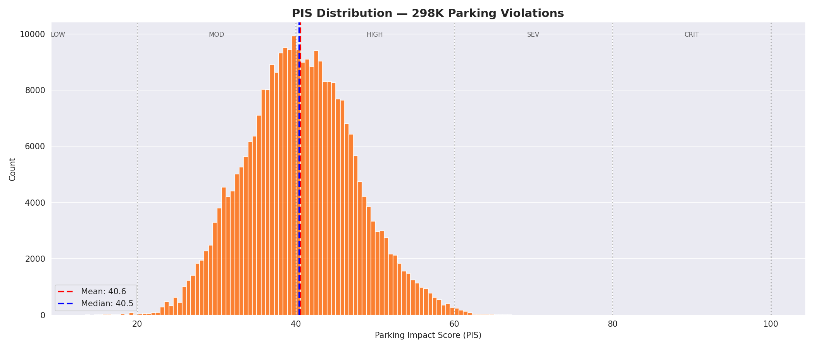
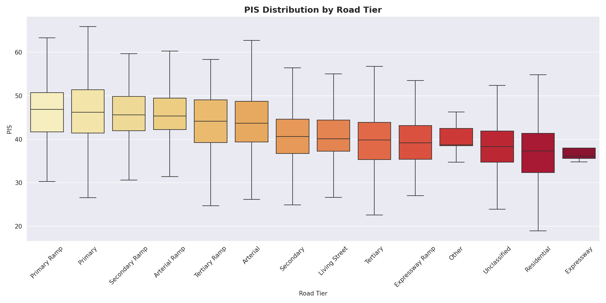
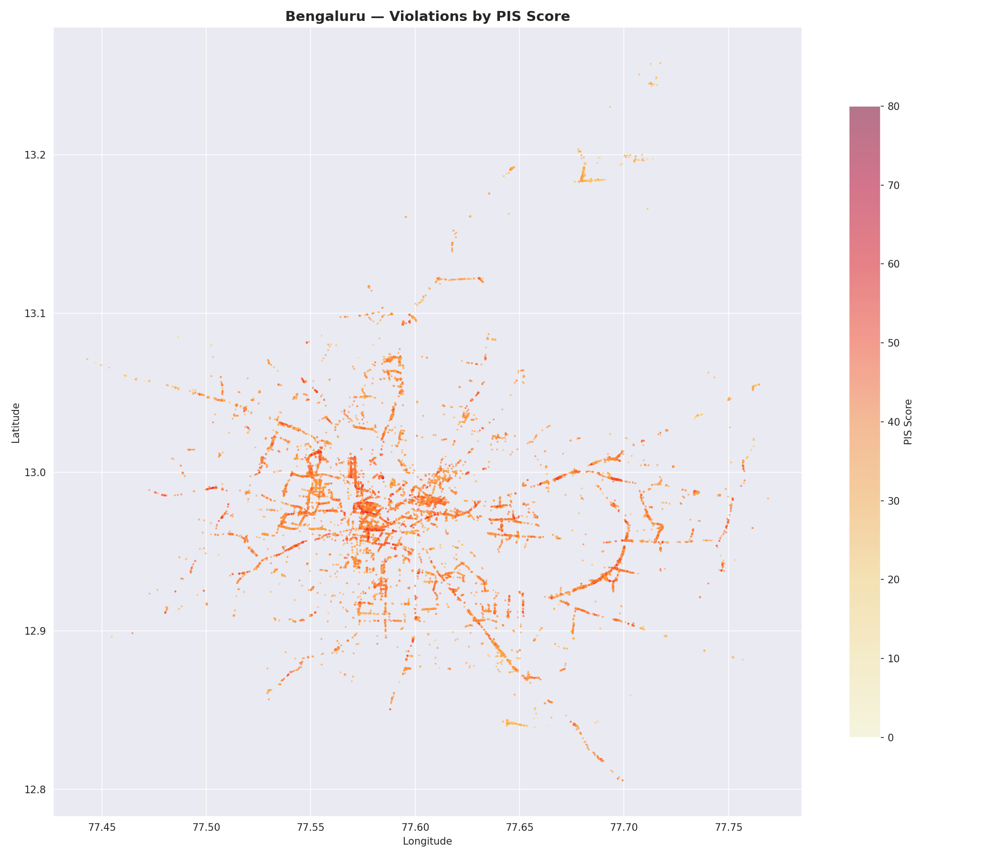
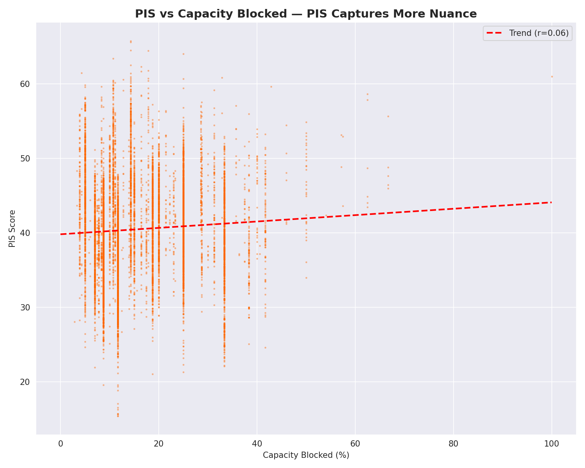
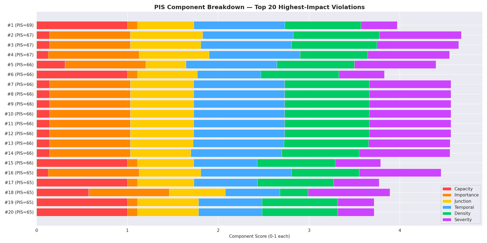
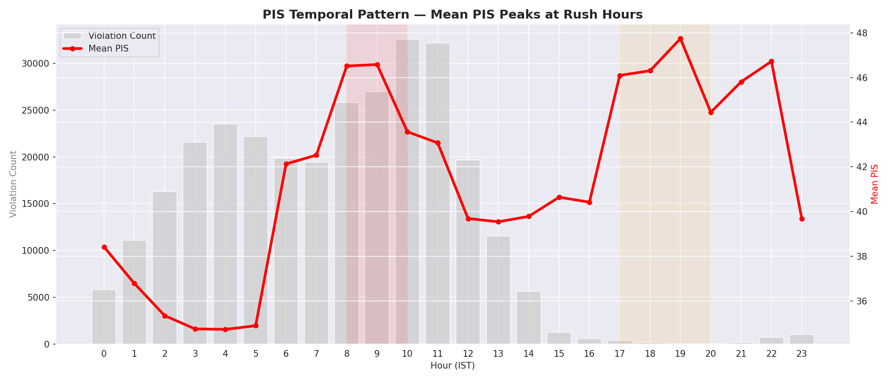
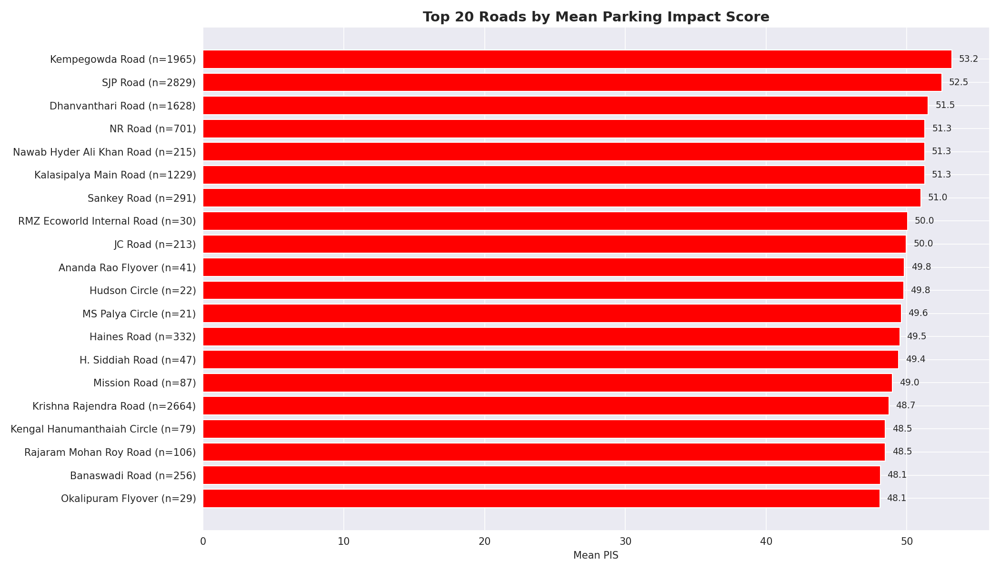
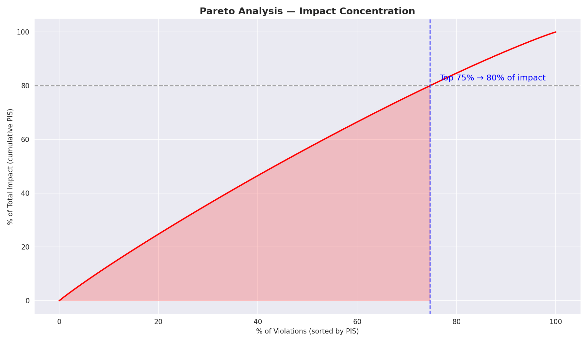
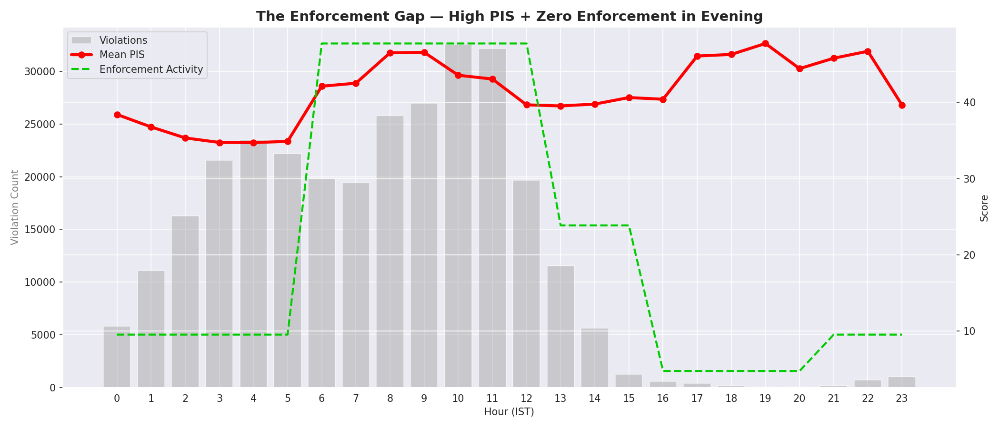
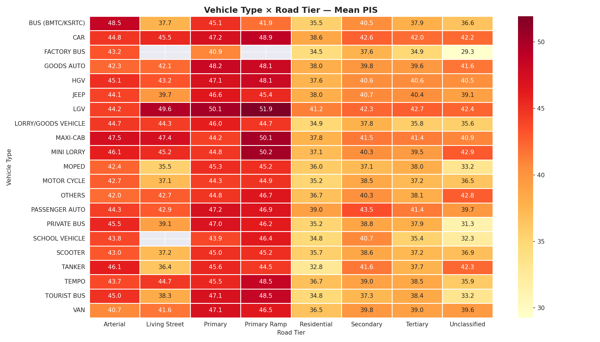
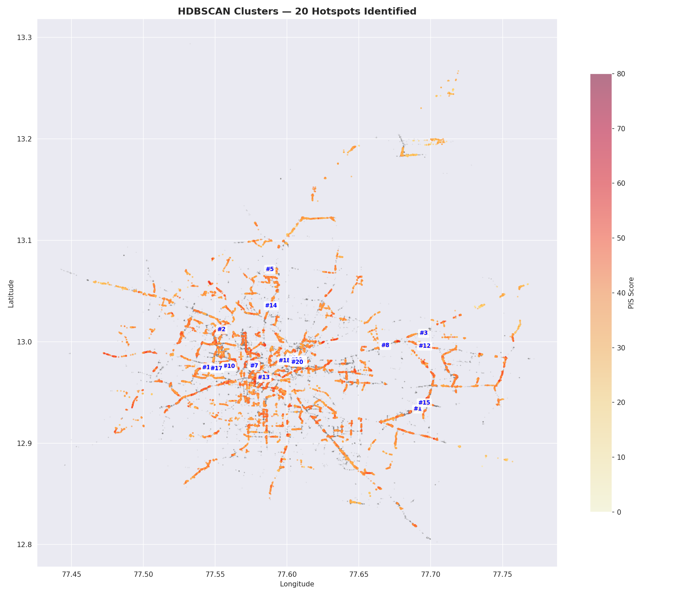
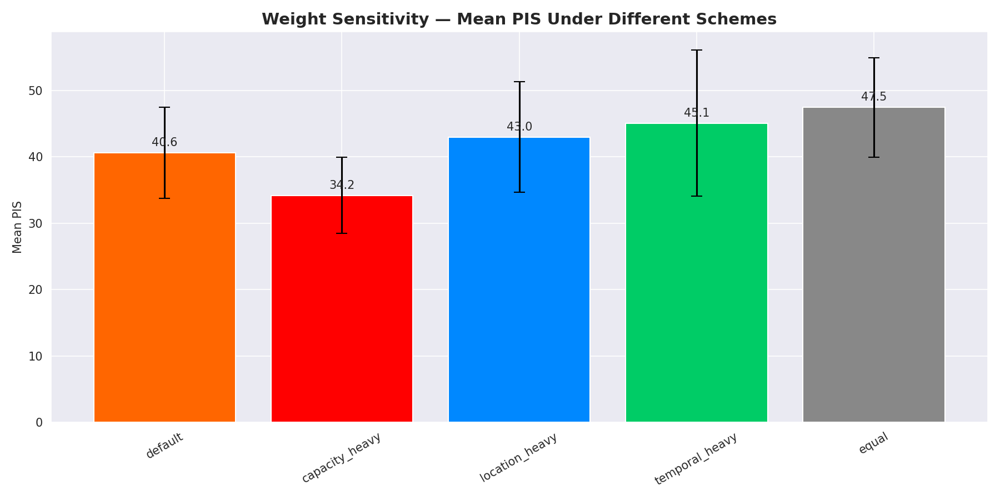
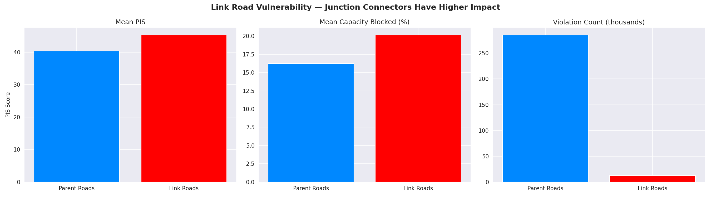
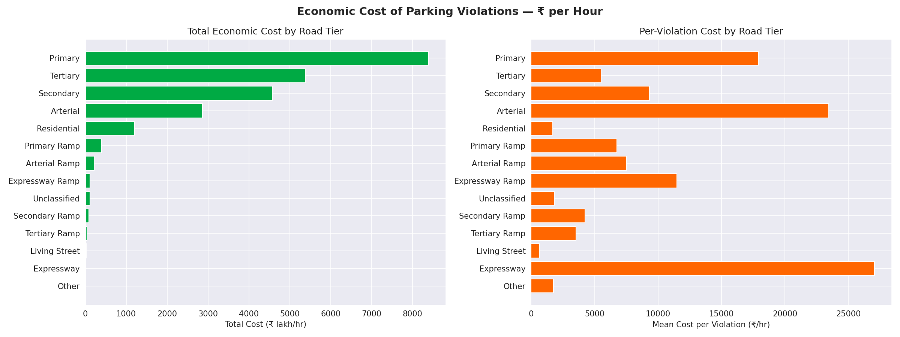
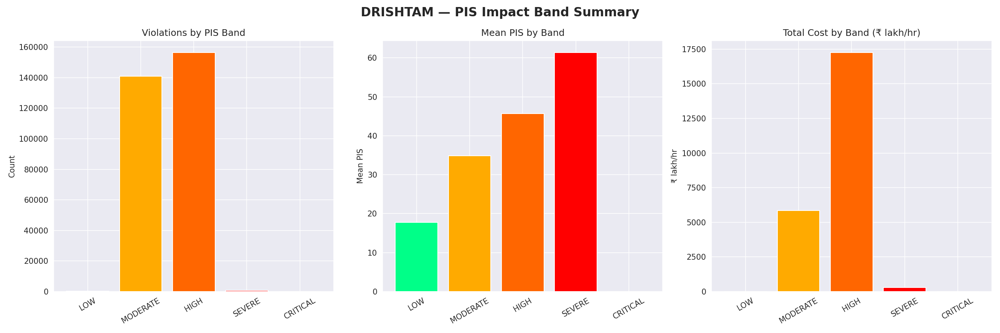